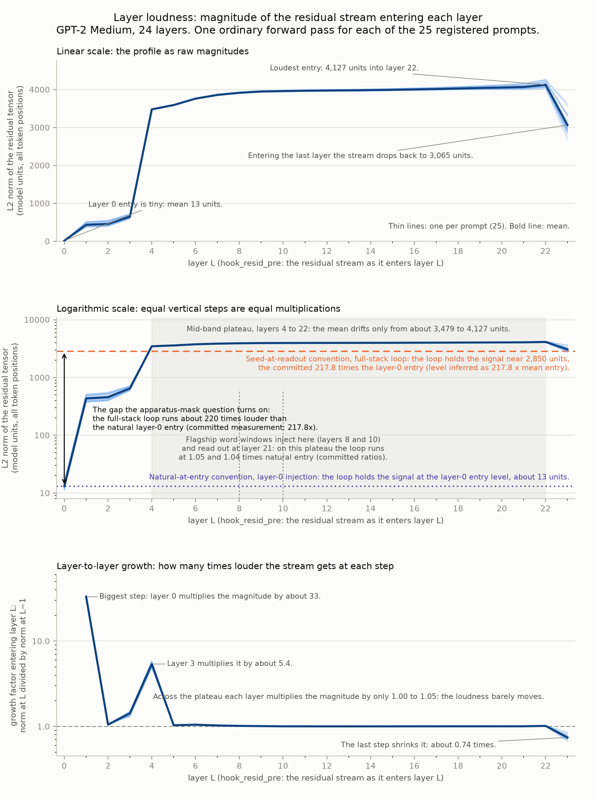
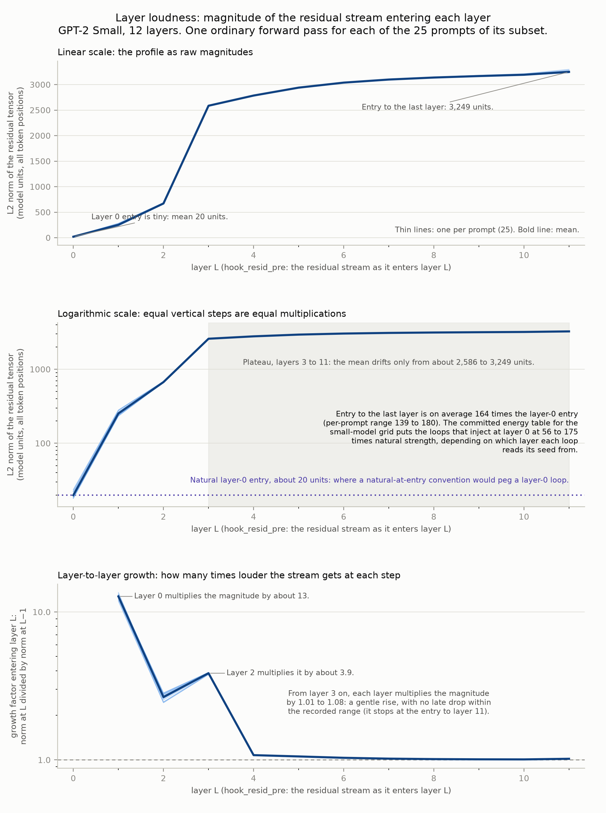
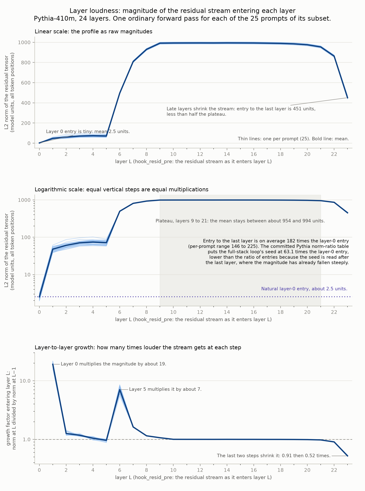

# The layer-loudness profile

**Written for:** TC and any reader of this repository, assuming no machine-learning background.
**What this is:** the committed, visual reference for what "loudness" means in this project and how it varies across each model's layers, chartered as issue #62 under TC's in-session direction of 2026-08-01.
**How it was produced:** no model was run for this document. Every curve below is drawn from measurement files already committed to this repository, and every derived number was computed from those files by the committed script `figures/make_loudness_figures.py`, whose console log (`figures/make_loudness_figures.log`) and derived-statistics file (`figures/loudness_profile_stats.json`) sit beside it.

---

## What loudness means here

As a language model reads a prompt, it keeps a running internal state called the residual stream: one list of numbers for every word-piece of the prompt (1,024 numbers per word-piece in GPT-2 Medium and Pythia-410m, 768 in GPT-2 Small), passed from layer to layer and modified at each one. The loudness of a layer is the overall size of that state as it enters the layer: square every number in the whole block, add the squares up, and take the square root. That single figure is called the L2 norm, and it plays the role a volume level plays for a sound. The recorded value covers the entire prompt at once, all word-piece positions together, not just the last one.

Loudness is measured at each layer's entrance, at the internal attachment point the codebase calls `hook_resid_pre`, on an ordinary forward pass: the model just reads the prompt once, with no injection and no looping. Layers are numbered from 0, so a 24-layer model has entries at layers 0 through 23. The units are the model's own internal units; they have no physical meaning, and only ratios between them matter.

The reason this profile matters is the project's central open question. The famous full-stack collapse on GPT-2 Medium was produced by a loop that injected its signal at layer 0 while holding it at the loudness of the deep readout point, which the committed control measured at 217.8 times the natural layer-0 entry. Whether that two-hundred-fold shouting, rather than the model, painted the founding picture is the apparatus-mask question. This document shows exactly what "natural" loudness looks like at every layer, so that ratio has a picture to live in.

## Where the data comes from

Everything below comes from three committed measurement files, one per model. Each was produced by the experiment runner's `--record-natural-norms` step (`experiments/exp_010c_windows/run_exp010c.py`), which makes one ordinary, injection-free forward pass per prompt and writes down the entry loudness at every layer. That recording step entered the runner for the energy-normalisation control (spec §4 of EXP_010c-VARIANTS, issue #14) and is reused by the small-model and Pythia specs (issues #16 and #12); it runs before any experiment arm touches the model.

- **GPT-2 Medium:** `experiments/exp_010c_windows/output/natural_resid_norms_energynorm_A0.json`, all 24 layers for the registered 25-prompt set (`output/prompt_subset.json`), recorded on 2026-07-25 during the energy-normalisation control of EXP_010c-VARIANTS (run log: `output/energynorm_A0.log`). The files with the A1, A4, and O8 suffixes were written by the other three arms of the same control and are byte-identical to it, which is exactly what should happen when the recorded pass involves no injection; the byte-identity was verified while preparing this document.
- **GPT-2 Small:** `output/natural_resid_norms_small010b_S1.json`, all 12 layers for the small-model 25-prompt set (`output/prompt_subset_small.json`), recorded during the EXP_010b window grid (run log: `output/small010b_S1.log`). The S2 through S5 and SB copies are byte-identical, verified the same way.
- **Pythia-410m:** `output/natural_resid_norms_pythia410m.json`, all 24 layers for the Pythia 25-prompt set (`output/prompt_subset_pythia.json`), recorded during EXP_012 as documented in `experiments/exp_010c_windows/RESULTS_EXP012_PYTHIA.md`. [No console log for the Pythia run is committed; that results file is the run's committed record.]

One limitation applies throughout: these files record the entry to every layer but stop there, so the loudness at the readout point after the last layer is not directly in them. Where that after-the-last-layer value matters below, it is inferred by combining the entry measurements with the seed-to-natural ratio tables committed in the results records, and each such number is marked as inferred in the sentence that states it.

## GPT-2 Medium: the curve the mask question lives on



The figure shows the same measurement three ways: as raw magnitudes, on a logarithmic scale where equal vertical steps mean equal multiplications, and as the growth factor from each layer to the next. Thin lines are the 25 individual prompts; the bold line is their mean. Reading the curve from left to right:

- **The entry is tiny.** The stream enters layer 0 at a mean of 13 units, ranging from 11 to 16 units across the 25 prompts. This is the natural loudness of the slot the full-stack loop injects into.
- **Almost all the growth happens in the first four layers.** Layer 0 multiplies the magnitude by about 33, the biggest single step anywhere in the network, taking the mean to 435 units. Layers 1 and 2 add little (factors of 1.05 and 1.42). Layer 3 multiplies by another 5.4, so the stream enters layer 4 at a mean of 3,479 units, already about 266 times its layer-0 entry.
- **The middle of the network is a plateau.** From the entry to layer 4 (3,479 units) to the entry to layer 22 (4,127 units, the loudest point on the curve), each layer multiplies the magnitude by only 1.00 to 1.05. The flagship word windows live here: they inject at layers 8 and 10 and read out at layer 21, and the committed control measured their loops at 1.05 and 1.04 times natural entry loudness, meaning that in the mid-band the registered apparatus was, by accident of the profile's flatness, already running at natural volume.
- **The deep end turns back down.** The last recorded step is a contraction: entering the final layer (layer 23) the stream falls to 3,065 units, 0.74 times the previous entry. The readout point sits after that final layer, and the committed ratio table implies its loudness is lower still, about 2,850 units on average; that level is inferred, computed as the committed 217.8 ratio times the measured mean layer-0 entry of 13.1 units.

**The 220-times figure, stated precisely.** The committed measurement is 217.8: the energy-normalisation control of EXP_010c-VARIANTS (Control B in `experiments/exp_010c_windows/RESULTS_EXP010C.md`) measured the full-stack loop's injected seed, whose loudness is fixed at the readout point after layer 23, at 217.8 times the natural entry loudness of layer 0, averaged over the 25 prompts. A closely related ratio can be computed from the entries file alone: the loudness entering layer 23 divided by the loudness entering layer 0 averages 235 per prompt, ranging from 195 to 268. The two numbers differ because they compare against different deep points: the committed 217.8 uses the state read after the final layer, where the magnitude has already contracted, while 235 uses the entry to that final layer. Both say the same thing at the resolution anything in the record turns on: the full-stack loop shouts at roughly 220 times the natural volume of the door it comes in through. [The operator report of 2026-07-31 already carries this reconciliation as a one-line bracket, quoting the independent recomputation as "about 235 times".]

## The two loudness conventions, and where each pegs its constant

The loop always holds its signal at a constant loudness while iterating; the two conventions differ only in which constant.

- **Seed-at-readout (the registered convention, `seed_j` in the code):** the fed-back signal keeps the loudness the state had where it was read out. For the full-stack cell that readout is after layer 23, so the constant sits near 2,850 units (inferred level, as above), which against a 13-unit natural entry is the committed 217.8-fold shout. The orange dashed line in the figure marks this level.
- **Natural-at-entry (the control convention, `natural_i`):** the fed-back signal is rescaled to the natural entry loudness of the layer it is injected into, measured per prompt on that prompt's own ordinary pass. For layer-0 injection that pegs the constant at about 13 units, the violet dotted line in the figure, and under this convention the collapse disappeared entirely: 0 of 25 prompts settled and the letter "D" appeared nowhere (committed Control B result).
- **In the mid-band the two conventions nearly coincide.** Because the plateau is flat, a seed read at layer 21 carries almost the same loudness as the natural entry at layers 8 or 10, so the two constants sit within 5 percent of each other (the committed ratios 1.05 and 1.04). That is why the flagship word-window results survive the energy control unchanged: for them, the choice of convention barely changes the volume.

## GPT-2 Small: same shape, smaller room



The small model's profile has the same anatomy. The stream enters layer 0 at a mean of 20 units (18 to 24 across prompts). Layer 0 multiplies the magnitude by about 13, layer 1 by 2.7, and layer 2 by another 3.9, so the stream enters layer 3 at a mean of 2,586 units, about 130 times its entry. From there to the entry of the final layer (3,249 units at layer 11) each layer multiplies by only 1.01 to 1.08. Whether the final layer contracts the stream the way Medium's does cannot be read from this file, because the recording stops at the entry to layer 11.

The full-stack ratio: the entry to layer 11 averages 164 times the layer-0 entry per prompt, ranging from 139 to 180. The committed energy table for the small-model grid (`experiments/exp_010b_small/RESULTS_EXP010B.md`, spec §5 record) puts the loops that inject at layer 0 at 56 to 175 times natural strength, a range rather than one number because each arm reads its seed at a different depth: the arm reading at layer 5 measured 153.7 times, the arm reading at layer 8 measured 160.3 times, and the full-stack baseline SB, which reads after the final layer, measured only 73.0 times (56.2 to 88.4 across prompts). Combining that committed 73.0 ratio with the measured 20-unit entry implies the after-the-final-layer readout carries only about 1,450 units, well under half the 3,249 units entering that layer; this is inferred from two committed artifacts, not directly measured, and it suggests the small model's final layer pulls the loudness down even more sharply than Medium's does.

## Pythia-410m: a plateau with a long fade-out



Pythia's profile is the least GPT-2-like of the three. The stream enters layer 0 at a mean of only 2.5 units (2.0 to 3.2 across prompts). Layer 0 multiplies the magnitude by about 19, but the second surge comes later than in the GPT-2 models: layer 5 multiplies by about 7, and the stream then climbs to a plateau where the mean stays between 954 and 994 units from the entry to layer 9 through the entry to layer 21. The deep end then fades rather than stepping down once: the last two recorded steps multiply by 0.91 and then 0.52, leaving the entry to the final layer at 451 units, less than half the plateau.

The full-stack ratio: the entry to layer 23 averages 182 times the layer-0 entry per prompt, ranging from 146 to 225. The committed Pythia ratio table (`experiments/exp_010c_windows/RESULTS_EXP012_PYTHIA.md`, spec §4 record) measured the full-stack loop's seed at 63.1 times the layer-0 entry, much lower than the ratio of entries because the seed is read after the final layer, by which point the fade has already happened; combining the committed 63.1 ratio with the measured 2.5-unit entry implies an after-the-final-layer loudness of roughly 160 units, an inferred value.

## Where the room analogy holds, and where it fails

The project's founding analogy says: feed a tone into a room, record the echo, feed the echo back, and repeat at constant volume until the room settles into the note it prefers. For the loop itself the analogy holds well, and this document adds the missing detail: the two conventions are just two settings of the volume knob, one pegged to how loud the echo was at the microphone (seed-at-readout), one pegged to how loud sounds naturally are at the door the echo re-enters through (natural-at-entry). On Medium's full stack those two settings differ by a factor of about 220, and this profile shows why: the microphone sits on the deep plateau near 3,000 units while the door sits at the 13-unit entry.

The analogy fails exactly where the record already says it fails, and the profile makes the failure visible. A real room is linear: turning the volume up scales the echo but cannot change which notes the room prefers. This model is not linear, and volume changes the outcome outright: at 217.8 times natural, every prompt collapsed to the letter "D"; at natural volume, with nothing else changed, no prompt settled at all and "D" never appeared (committed Control B result). No linear room can be made to hum, or stop humming, by the volume knob alone. The loudness profile in this document is therefore not just background scenery; it is the map of how far from natural the apparatus was operating at each possible injection point, which for the mid-band flagship cells was almost not at all and for the layer-0 cells was two orders of magnitude.

## Every headline number and its source

| Number | What it is | Where it comes from |
|---|---|---|
| 13.1 units (11.1 to 16.2) | Mean loudness entering layer 0 of GPT-2 Medium, with the per-prompt range | Computed from `output/natural_resid_norms_energynorm_A0.json` by the committed script |
| 3,479 to 4,127 units | GPT-2 Medium's mid-band plateau, entries to layers 4 through 22 | Same file, same script |
| 3,065 units; step factor 0.74 | Loudness entering GPT-2 Medium's final layer, and the contraction that produces it | Same file, same script |
| 217.8 | Committed ratio of the full-stack loop's seed loudness to the natural layer-0 entry on Medium | `experiments/exp_010c_windows/RESULTS_EXP010C.md`, Control B (established) |
| 235.1 (194.5 to 268.3) | Per-prompt ratio of Medium's entry-to-layer-23 loudness over its entry-to-layer-0 loudness | Computed from the entries file by the committed script |
| about 2,850 units | The full-stack loop's constant loudness level on Medium | Inferred: 217.8 times the measured 13.1-unit mean entry |
| 1.04 and 1.05 | Loop loudness relative to natural entry at the flagship windows (inject at layers 10 and 8, read at 21) | `RESULTS_EXP010C.md`, Control B (established) |
| 19.9 units; 164.4 (138.8 to 180.1) | GPT-2 Small's mean layer-0 entry, and the per-prompt entry-to-layer-11 over entry-to-layer-0 ratio | Computed from `output/natural_resid_norms_small010b_S1.json` by the committed script |
| 56 to 175; 73.0 for the full stack | Committed seed-to-natural ratios for the small-model loops injecting at layer 0 | `experiments/exp_010b_small/RESULTS_EXP010B.md`, energy record (established) |
| 2.5 units; 182.4 (145.7 to 225.0) | Pythia-410m's mean layer-0 entry, and the per-prompt entry-to-layer-23 over entry-to-layer-0 ratio | Computed from `output/natural_resid_norms_pythia410m.json` by the committed script |
| 63.1 | Committed seed-to-natural ratio for Pythia's full-stack loop | `experiments/exp_010c_windows/RESULTS_EXP012_PYTHIA.md`, norm-ratio table (established) |

All computed values above, including the full per-layer means and per-step growth factors, are written out in `figures/loudness_profile_stats.json` with a provenance block naming the exact source file for each model.

## Reproducing the figures

From the repository root, with Python 3 and matplotlib installed:

```
cd _STAGE2_JSPACE/figures
python3 make_loudness_figures.py
```

The script reads only the three committed measurement files named above, rewrites the three PNG figures and the statistics file deterministically, and prints the summary lines captured in `make_loudness_figures.log`.
