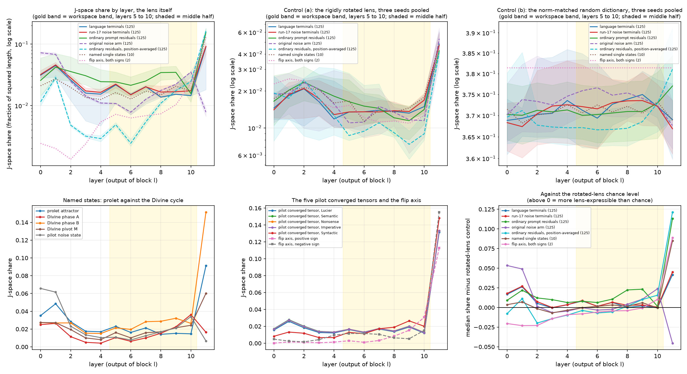

# EXP_011 results record: does GPT-2 Small's settled state hold anything the model could say?

**Spec:** `../../EXP_011_SPEC.md`, pre-registered and committed at `593e1f9` on
branch `claude/latent-context-small-llms-u2jdig-exp011`, before any state was
measured. **Register:** `_STAGE2_JSPACE/REGISTER.md`, hypotheses H6, H16, H16a
and H16b, allocated by erratum (f) on 2026-09-05. **Tracker:** issue #78.
**Proposed register rows:** `REGISTER_VERDICTS.md` in this directory. This
branch does not edit the register.

---

## 2026-09-05: the answer first

**The loop's settled states hold less of what GPT-2 Small could put into words
than the same prompts hold before the loop runs, and at matched injection
strength a settled state made from language is indistinguishable from one made
from random noise.** Those are the two results, and only the first of them is a
hypothesis that came out supported.

In numbers. The measure is the **J-space share**: the fraction of a state's
squared length that can be built out of at most 25 of the 50,257 directions the
Jacobian lens assigns to vocabulary words, using positive weights only. It runs
from 0, none of the state, to 1, all of it. Across the six workspace-band layers
(layers 5 to 10 of 12), the loop's settled language states hold a median share
between 0.0137 and 0.0217, while the same 125 prompts run once with no loop hold
between 0.0157 and 0.0348 at the same layers. The settled state is lower at five
of those six layers, on 64 to 96 percent of the 125 prompt-by-prompt pairs, with
a permutation p of 0.0032 at one layer and 0.0001 at the other four, where
0.0001 is the smallest value 10,000 permutations can report. That is H16b,
**SUPPORTED**.

Set beside that, the loop's settled language states and the matched-strength
noise states are the same to the lens. Their median shares differ by between
-0.0029 and +0.0002 on shares of about 0.015 to 0.022, which is a difference of
at most one part in five and usually far less, and in the band the sign runs
against the hypothesis more often than for it. Restricting the noise arm to the
90 trials that passed the convergence gate shrinks the gap further, to between
-0.00046 and -0.00001. That is H16, **NOT SUPPORTED**, and it is the same
inversion that lucier finding F4 reports from the basin counts, now seen through
a completely different instrument.

Two things the hypotheses did not ask, which matter more than two of the
verdicts. First, **the mid-layers say things the last layer does not.** The
directions the decomposition picks for the `prolet` attractor at layers 5, 8 and
10 are the words `the`, `Marx`, `Lenin`, `prolet`, `horizont`, `princ` and
`comrade`: a political vocabulary field. At layer 11, where the lens is the
identity and the reading is the ordinary logit lens, the same decomposition
picks only `the`, `,`, `and`, `"` and `in`: function words carrying no content
at all. Second, **that small slice is causally in charge of the output.** At
layer 5 the `prolet` state's J-space component is 2.3 percent of its squared
length; deleting just that component and putting the state back into the model
changes the model's own top output word from ` prolet` at probability 0.086 to
` abstract` at 0.027, and doubling only that component raises ` prolet` to 0.131.
At layer 10 doubling it raises ` prolet` from 0.086 to 0.569. A 1.5 to 2.3
percent slice of the state decides what the model says.

### The four verdicts on their registered wordings

| Hypothesis | Registered claim, in short | Verdict | The number that decides it |
|---|---|---|---|
| H6 | GPT-2 Small's five basin tensors project significantly more onto the J-space than the 18 null-model basins | **NOT SUPPORTED** | The five basins beat the eighteen with a one-sided p below 0.05 at three of the six band layers (layers 5, 6 and 7, p = 0.023, 0.015, 0.015), and lose at layer 10 (p = 0.033 the other way). The pre-registered rule needed four of six. |
| H16 | Language terminals hold a higher share than the matched-strength noise terminals at the band layers, above the random-dictionary chance level | **NOT SUPPORTED** | Language exceeds noise at two of six band layers, by +0.0002 both times, against shares of 0.015 to 0.022, and no band layer reaches p below 0.05 in that direction. Three band layers run significantly the other way. |
| H16a | The `prolet` attractor's share exceeds the `Divine` cycle's share in both phases | **NOT SUPPORTED** | `prolet` beats the trace injected from phase A at three of six band layers and the trace injected from phase B at one of six. The pre-registered rule needed four of six against each phase, and the rule is symmetric in the two phases, so the verdict does not turn on which trace carries which name. Finding F16 is not overturned: see the correction below. |
| H16b | ATR terminal states have a lower share than ordinary non-iterated prompt residuals at the same layer | **SUPPORTED** | The settled state is lower at five of the six band layers, with permutation p of 0.0032, 0.0001, 0.0001, 0.0001 and 0.0001, and median paired differences of -0.0041, -0.0072, -0.0063, -0.0189 and -0.0170 against terminal shares of 0.0137 to 0.0217. |

---

## The shape of the instrument, measured

This is the single most important thing to know before reading any share below,
and it was not anticipated in the specification. It is measured, not inferred.

The 50,257 lens directions at a layer are not spread out over the
768-dimensional space. They are packed around one common direction. Taking the
average of all 50,257 of them after setting each to unit length gives a vector
whose own length is **0.786 to 0.872 across the six band layers**, on a scale
where 0 would mean perfectly even spread over the sphere and 1 would mean every
direction identical. For comparison, the norm-matched random dictionary used as
one of the controls gives **0.0044** on the same scale. Between 99.0 and 99.6
percent of the lens directions lie on the positive side of that common
direction. At layer 11, where the lens is the identity and the reading is the
ordinary logit lens, the concentration is 0.518 and every single direction lies
on the positive side.

Two consequences follow, and both matter for reading the tables.

First, the positive cone the decomposition may reach is narrow. A state pointing
away from the dictionary's common direction cannot be built out of these
directions with positive weights, no matter how many are allowed. Measured: the
loop's settled language states sit at median cosine -0.182, -0.170 and -0.173 to
that common direction at layers 5, 6 and 7, where 0 is what an unrelated
direction would give, while the same prompts' ordinary residuals sit at -0.070,
-0.040 and -0.035 at the same three layers. This is why the search usually
stops after three or four directions rather than the 25 it is allowed: there is
nothing left that any direction points toward. When it stops for that reason the
answer is not an approximation. It is the exact nearest point of the positive
cone over all 50,257 directions, so the 25-direction limit is not what is
holding these numbers down. That holds for every decomposition of the 125
language terminals, of the 125 run-17 noise terminals and of the named single
states, at every layer, and for 1,409 of the 1,500 ordinary-residual
decompositions. The 91 that did reach the limit are covered by the solver
limitation below, and their shares are lower bounds.

Second, the norm-matched random dictionary is not a like-for-like chance level.
Its cone is nearly the whole space, so it captures more of almost any state for a
reason that has nothing to do with the lens's content. The rotated-lens control
keeps the concentration exactly, rotating the whole cloud rigidly, and only
destroys where it points. Where the two controls disagree below, the rotated
lens is the informative one, and this is flagged at each place.

---

## The four hypotheses in detail

Throughout, a **layer** is the residual stream at the output of one of GPT-2
Small's twelve blocks, and the **band layers** are 5 to 10 inclusive, the paper's
workspace band mapped onto twelve layers (0.38 times 12 is 4.56, rounding inward
to 5; 0.92 times 12 is 11.04, rounding inward to 11) intersected with the layers
the lens was fitted for, which are 0 to 10. Layer 11 is the identity, so its
reading is the ordinary logit lens. Band layers are shown in bold in every table.

### H6: the five basins against the eighteen null-model basins

**NOT SUPPORTED on the registered wording.**

H6 compares one representative of each of GPT-2 Small's five basins, which are
the five words its settled states read out as, with one representative of each
of the 18 basins the original noise arm produced. The representative is each
basin's medoid, the member whose average cosine to the other members of its own
basin is highest, chosen by a rule written down before any share was seen. Both
sides are read at iteration 100 of their own original sweep, which is what makes
them comparable.

| layer | five basins, median | eighteen null basins, median | one-sided p (basins greater) | five basins, random-dictionary control |
|---|---|---|---|---|
| 0 | 0.0305 | 0.0706 | 0.9999 | 0.3681 |
| 1 | 0.0442 | 0.0718 | 0.9998 | 0.3672 |
| 2 | 0.0254 | 0.0262 | 0.6808 | 0.3715 |
| 3 | 0.0155 | 0.0149 | 0.5715 | 0.3733 |
| 4 | 0.0149 | 0.0112 | 0.2016 | 0.3744 |
| **5** | 0.0213 | 0.0106 | 0.0229 | 0.3730 |
| **6** | 0.0149 | 0.0076 | 0.0151 | 0.3701 |
| **7** | 0.0203 | 0.0120 | 0.0151 | 0.3717 |
| **8** | 0.0135 | 0.0144 | 0.4856 | 0.3746 |
| **9** | 0.0152 | 0.0172 | 0.5431 | 0.3749 |
| **10** | 0.0145 | 0.0288 | 0.9723 | 0.3748 |
| 11 | 0.0878 | 0.0102 | 0.0045 | 0.3714 |

The five basins beat the eighteen at layers 5, 6 and 7 with one-sided p of
0.023, 0.015 and 0.015, and lose at layer 10 with p of 0.033 in the reverse
direction. Three supporting layers is one short of the pre-registered majority of
four, so the verdict is NOT SUPPORTED rather than SUPPORTED. The direction is not
weak where it holds: at layer 6 the basins sit at 0.0149 against the null basins'
0.0076, roughly double.

Reported alongside, not scoring, and much sharper because it uses every state
rather than one per basin: comparing all 125 language terminals with all 125
original-noise terminals gives one-sided p of 2e-14, 7e-12 and 5e-12 at layers 5,
6 and 7, and p of 1.000 at layers 8, 9 and 10 where the comparison reverses. So
the language-versus-original-noise difference is real and large in the first half
of the band and real and large in the opposite direction in the second half. A
single verdict on this comparison would have been the wrong shape of answer.

**Read this verdict with the caveat the register already carries.** The 18-basin
arm is the one lucier finding F4 records as mis-scaled. Measured here from the
same files: that arm was injected at an average length of 401.3, while the
language arm was injected at 1427.5, so it ran at 28 percent of the language
arm's strength, and its labels were read at iteration 100 before it had settled.
H6's comparison is therefore between a settled arm and an unsettled, quieter arm.
Whatever this verdict is, it is not evidence about language against noise at
matched strength. H16 is that question, and it is answered next.

### H16: language terminals against the matched-strength noise terminals

**NOT SUPPORTED on the registered wording.**

| layer | language, median | noise, median | difference | permutation p | language above random-dictionary control | language above rotated-lens control |
|---|---|---|---|---|---|---|
| 0 | 0.0313 | 0.0320 | -0.0007 | 0.8680 | no | yes |
| 1 | 0.0448 | 0.0459 | -0.0011 | 0.8544 | no | yes |
| 2 | 0.0260 | 0.0284 | -0.0023 | 0.9999 | no | yes |
| 3 | 0.0160 | 0.0173 | -0.0013 | 0.9991 | no | no |
| 4 | 0.0154 | 0.0164 | -0.0011 | 0.9972 | no | yes |
| **5** | 0.0217 | 0.0224 | -0.0006 | 0.9909 | no | yes |
| **6** | 0.0152 | 0.0150 | +0.0002 | 0.1405 | no | yes |
| **7** | 0.0204 | 0.0202 | +0.0002 | 0.2507 | no | yes |
| **8** | 0.0137 | 0.0166 | -0.0029 | 1.0000 | no | yes |
| **9** | 0.0153 | 0.0168 | -0.0015 | 0.9149 | no | yes |
| **10** | 0.0145 | 0.0174 | -0.0029 | 0.9999 | no | no |
| 11 | 0.0899 | 0.0922 | -0.0023 | 0.8955 | no | yes |

The two families are the same to this instrument. Across the six band layers the
median difference runs from -0.0029 to +0.0002 on shares of 0.0137 to 0.0224, and
the two layers where language is ahead are ahead by +0.0002, which is one part in
a hundred of the share. No band layer reaches p below 0.05 in the hypothesised
direction; three run significantly the other way. Restricting the noise arm to
the 90 trials that passed the convergence gate, so that both sides are settled,
shrinks the gap to between -0.00046 and -0.00001 and leaves no layer close to
significance in either direction. This is the F4 inversion seen by a second,
independent instrument: at matched injection strength, what the loop settles on
is a property of the weights, not of language-shaped input.

**The third condition in the registered rule failed for a reason that is about
the instrument, not about the states.** H16's wording requires the language
median to sit above the norm-matched random-dictionary chance level. It does not,
at any layer, and neither does anything else measured here: that control sits at
0.369 to 0.375 while every real family sits between 0.008 and 0.036. The gap is a
factor of about 25 and it is entirely explained by the shape finding above. A
random dictionary's positive cone is nearly the whole space; the lens's is
narrow. **Against the rotated-lens control, which preserves the lens's shape
exactly, the language terminals sit above chance at five of the six band layers on
the comparison of medians the registered rule uses** (0.0217 against 0.0135 at
layer 5, 0.0152 against 0.0135 at layer 6, 0.0204 against 0.0139 at layer 7,
0.0137 against 0.0136 at layer 8, 0.0153 against 0.0132 at layer 9, and 0.0145
against 0.0149 at layer 10, the one exception). Changing which control counts is a
ruling for the operator, not a change this record makes on its own; it is decision
item 1 below.

**That five-of-six count is a comparison of medians, and it does not entirely
survive being tested state by state.** Pairing each of the 125 language terminals
with its own rotated-lens control share, averaged over the three rotation seeds,
and testing the 125 paired differences with a sign-flip permutation test of 10,000
draws, one-sided in the direction "language higher", gives a median paired
difference of +0.0072 at layer 5 with p of 0.0001 and 73 of every 100 pairs
running that way, +0.0011 at layer 6 with p of 0.0039 and 68 percent, +0.0053 at
layer 7 with p of 0.0001 and 72 percent, and +0.0014 at layer 9 with p of 0.0001
and 100 percent, where 0.0001 is the smallest value 10,000 permutations can
report. At layer 8 it gives -0.0008 with p of 0.8270 and only 43 percent of pairs
running that way, and at layer 10 -0.0015 with p of 0.9982 and 29 percent. So on
the paired reading the language terminals are above their own rotated-lens chance
level at four of the six band layers, not five: layer 8's margin on the medians,
0.0137 against 0.0136, is a difference of one part in a hundred of the share and
the paired test puts its sign the other way. This test was added after the
specification was written, so under section 9 item 5 it is exploratory and carries
no verdict; it is recorded in `output/verdicts.json` under
`H16.lang_above_rotation_control_exploratory`.

**The robustness reading the specification pre-registered under control (a) is now
run, and it does not rescue H16 either.** Section 7.2 asked for "the same test
under control (a)", meaning the same language-against-noise label-permutation test
carried out on the shares those same 250 states score against the rotated lens.
The first version of this record omitted it; it was added on review and is in
`output/verdicts.json` under `H16.rotation_control_secondary`. Pooling the three
rotation seeds, the median difference between the two families at the band layers
runs from -0.0019 to +0.0004 on shares of about 0.013 to 0.015, and the one-sided
permutation p in the language-greater direction is 0.5087 at layer 5, 0.5028 at
layer 6, 0.0410 at layer 7, 0.7567 at layer 8, 0.9896 at layer 9 and 0.9970 at
layer 10. Only layer 7 falls below 0.05, one band layer out of six against a rule
that needs four. Read seed by seed the picture is unstable rather than
informative: at layer 6 the three rotations give p of 0.9999, 0.0001 and 0.5769
for the same comparison, so a single rotation's p-value here is telling us about
that rotation and not about the two families. Three seeds is too few to read a
per-seed p-value from, and that is stated as a limit of this control rather than
discovered later.

### H16a: the `prolet` attractor against the `Divine` cycle's two phases

**NOT SUPPORTED on the registered wording. Finding F16 is not overturned: at the
one layer where this experiment and F16 measure the same thing, F16's direction
reproduces.**

**Correction, dated 2026-09-05.** An earlier version of this section, committed
the same day at `0c94f69`, said that on the full-vocabulary lens the `Divine`
cycle's phase assignment inverts, that phase B is the more lens-expressible phase
and phase A the less, and it called that "a retraction of a directional claim"
against lucier finding F16. That reading was wrong. It is named here rather than
edited away, and what is true instead is set out below. Two separate mistakes
produced it, and both have now been checked against the code and against the
committed states.

**The first mistake is a label.** The state builder `build_states.py` names each
per-layer trace after the vector it injects at that trace's input, not after what
the trace holds at the layer being read. The entry called `phaseA` is therefore
the forward pass whose input is phase A, and what that pass holds at layer 11 is
its own output, which for a period-2 cycle, meaning a state the loop returns to
only after two steps rather than one, is phase B. Measured directly on the
committed state file against the phase vectors the pilot stored
(`output_jlens_phase/phase_states.pt`): the cosine between the layer-11 entry of
the trace called `phaseA` and the stored phase B vector is 1.000000, and between
the layer-11 entry of the trace called `phaseB` and the stored phase A vector is
also 1.000000, on a scale where 1 means the same direction and 0 means unrelated.
So in the layer-11 row of the table below, the column headed "trace injected from
phase A" holds phase B, at 0.0164, and the column headed "trace injected from
phase B" holds phase A, at 0.1516. The earlier version of this section headed
those two columns "Divine phase A" and "Divine phase B", and that is what made
the two numbers read as an inversion of F16. This is established by measurement,
not inferred.

**The second mistake is that outside layer 11 the two experiments are not
measuring the same quantity at all.** F16 scored the single 768-number vectors A
and B against every layer's dictionary with no forward pass anywhere: that is
`10_jlens_phase.py` stage 2, whose function `probe_state` loops one fixed vector
over the twelve dictionaries. This experiment, following its own specification's
section 2.2, splices a state into the model's input and reads the residual stream
on the way through, so at layers 0 to 10 what it scores is an intermediate
residual of one loop step and not a phase vector at all. Measured: the layer-0
entry of the trace called `phaseA` sits at cosine 0.913 to phase A and 0.600 to
phase B, so it is neither of them. Any comparison drawn at the band layers is
therefore confounded with the change in how the state was constructed, and cannot
bear on F16 in either direction.

**A third point, marked as inferred rather than established, is that the
specification itself is ambiguous here.** Section 2.2's framing sentence says each
state is turned into per-layer states by "running exactly the loop step that
produced it", which names the pass whose *output* is that state, while its
numbered steps say to rebuild and splice the state itself, which names the pass
whose *input* is that state. Those are the same pass for a fixed point, a state
the loop returns unchanged, and that is the case the reconstruction gate checks.
They are opposite passes for a period-2 cycle. So for the `Divine` phases the two
labels may simply be inverted with respect to the reading of the specification an
attentive reader would take. Nothing in the verdict depends on the choice, for the
reason set out under the verdict below.

| layer | prolet | trace injected from phase A | trace injected from phase B | trace injected from pivot M | prolet minus the phase-A trace | prolet minus the phase-B trace | seed spread within the rotated-lens control (one standard deviation) | pooled spread over all six control runs (one standard deviation) |
|---|---|---|---|---|---|---|---|---|
| 0 | 0.0352 | 0.0250 | 0.0272 | 0.0274 | +0.0102 | +0.0079 | 0.00324 | 0.1777 |
| 1 | 0.0485 | 0.0264 | 0.0269 | 0.0272 | +0.0221 | +0.0216 | 0.00435 | 0.1781 |
| 2 | 0.0283 | 0.0115 | 0.0270 | 0.0195 | +0.0168 | +0.0013 | 0.00529 | 0.1779 |
| 3 | 0.0175 | 0.0051 | 0.0154 | 0.0100 | +0.0124 | +0.0021 | 0.00613 | 0.1795 |
| 4 | 0.0170 | 0.0042 | 0.0150 | 0.0081 | +0.0128 | +0.0020 | 0.00681 | 0.1778 |
| **5** | 0.0231 | 0.0105 | 0.0214 | 0.0161 | +0.0126 | +0.0017 | 0.00482 | 0.1775 |
| **6** | 0.0162 | 0.0062 | 0.0197 | 0.0101 | +0.0100 | -0.0034 | 0.00447 | 0.1797 |
| **7** | 0.0213 | 0.0101 | 0.0283 | 0.0159 | +0.0113 | -0.0070 | 0.00191 | 0.1810 |
| **8** | 0.0141 | 0.0153 | 0.0288 | 0.0169 | -0.0012 | -0.0147 | 0.00198 | 0.1799 |
| **9** | 0.0152 | 0.0226 | 0.0322 | 0.0215 | -0.0074 | -0.0170 | 0.00087 | 0.1818 |
| **10** | 0.0147 | 0.0363 | 0.0265 | 0.0243 | -0.0216 | -0.0118 | 0.00281 | 0.1786 |
| 11 | 0.0912 | 0.0164 | 0.1516 | 0.0602 | +0.0748 | -0.0603 | 0.00688 | 0.1587 |

The three `Divine` columns are named for the vector injected at each trace's
input. At layer 11 that means the column headed "trace injected from phase A"
holds phase B and the column headed "trace injected from phase B" holds phase A;
at layers 0 to 10 both hold intermediate residuals of one loop step.

**The verdict, and why it does not depend on which trace carries which name.** The
`prolet` attractor is above the trace injected from phase A at layers 5, 6 and 7
and below it at layers 8, 9 and 10, which is three of the six band layers; it is
above the trace injected from phase B at layer 5 only, which is one of six. The
pre-registered rule records SUPPORTED only if `prolet` is above *both* at four of
the six band layers, and REFUTED only if *both* are above `prolet` at four of six.
Neither holds, so the verdict is NOT SUPPORTED. Both conditions are conjunctions
over the two phases, so exchanging the two labels exchanges the two counts and
leaves each condition exactly as it was: with the labels swapped the counts read
one of six and three of six, and the verdict is still NOT SUPPORTED. That is
established by the structure of the rule and needs no further measurement.

**What the layer-11 comparison shows, which is the only like-for-like reading of
F16 available here.** At layer 11 the lens matrix is the identity, so the reading
is the ordinary logit lens, and the object scored is a single settled vector
rather than an intermediate residual. That holds for all three states here, and it
is checked rather than assumed: the layer-11 entry of the `prolet` trace has
cosine 1.000000 with the stored `prolet` attractor, because `prolet` is a fixed
point and one loop step returns it unchanged, and the two phase traces carry the
two stored phase vectors at cosine 1.000000 as set out above. Labelled correctly,
the three numbers are
phase A at 0.1516, `prolet` at 0.0912 and phase B at 0.0164, on the 0-to-1 share
scale, where each state's own rotated-lens chance level at that layer is 0.0475
for phase A, 0.0473 for `prolet` and 0.0553 for phase B. So phase A sits at about
three times its chance level, `prolet` at about twice, and phase B below its own
chance level. F16, working with the pilot's restricted 193-word dictionary and its
own sparse probe, reported at the same layer phase A 0.098, `prolet` 0.091 and
phase B 0.070. The two orderings are the same one: phase A above `prolet` above
phase B. **F16's layer-11 direction therefore reproduces on the full 50,257-word
lens.** The magnitudes are not comparable between the two instruments, because a
193-word dictionary and a 50,257-word dictionary span different sets of
directions, but the ordering is the claim F16 made and it holds.

**What this experiment cannot say about F16.** At the band layers it does not
measure what F16 measured, so it neither confirms nor refutes F16 there, and the
band-layer rows above should not be read as evidence about the phases as objects.
Scoring the phase vectors themselves against layers 0 to 10, which is what would
make the comparison like-for-like across the band, is a small additional run that
this branch has not done. It is listed under what remains.

The pivot, the midpoint of the two phases, does not come out as the most
lens-expressible object here: its trace sits between the two phase traces at every
band layer, for example 0.0169 at layer 8 against 0.0153 and 0.0288. F16 reported
the pivot as the most lens-expressible state it probed. That comparison is not
like-for-like and should not be read as a contradiction, for three reasons. F16's
pivot mixed two different scalings, taking phase A at its raw length and phase B
rescaled to the loop's starting length, while this run rescales both phases before
averaging, which is the deviation recorded below. The pivot trace's layer-11 entry
is the pivot after one loop step rather than the pivot itself, at cosine 0.945 to
the pilot's stored pivot. And at the band layers it is an intermediate residual,
the same confound as for the phases.

**The materiality floor written into the specification turned out to be
uninformative, and is replaced by a labelled substitute.** The specification said
a gap smaller than the spread of the state's own control shares across the six
control runs should be marked as inside the control spread. Because the two
control types differ by a factor of about 25, that pooled spread is 0.178 to 0.182
at every band layer, which swamps every gap in the table and would mark every one
of them as immaterial. The informative yardstick is the spread within one control
type: across the three rotated-lens seeds the `prolet` state's share varies with a
standard deviation of 0.0009 to 0.0048 at the band layers. Measured against that,
the gaps against the phase-A trace at layers 5, 6 and 7 (+0.0126, +0.0100,
+0.0113) are 2.6, 2.2 and 5.9 times the seed spread, and the gaps against the
phase-B trace at layers 8, 9 and 10 (-0.0147, -0.0170, -0.0118) are 7.4, 19.5 and
4.2 times it, so all six are material on this yardstick. The gaps against the
phase-B trace at layers 5, 6 and 7 (+0.0017, -0.0034, -0.0070) are 0.4, 0.8 and
3.7 times the seed spread, so the first two are smaller than the run-to-run
variation of the control itself and should not be leaned on at all. Both spreads
are now computed and recorded per layer in `output/verdicts.json`, as
`prolet_control_spread_sd_rotation` and `prolet_control_spread_sd`, so every ratio
above has a committed provenance. This substitution is post hoc, it is labelled as
such, and it changes no verdict: the verdict rule counted signs, not sizes.

### H16b: settled states against the same prompts' ordinary residuals

**SUPPORTED on the registered wording.**

| layer | terminal, median | ordinary residual, median | median paired difference | permutation p (terminal lower) | share of the 125 pairs with the terminal lower |
|---|---|---|---|---|---|
| 0 | 0.0313 | 0.0257 | +0.00507 | 0.9051 | 44 percent |
| 1 | 0.0448 | 0.0422 | -0.00185 | 0.3229 | 53 percent |
| 2 | 0.0260 | 0.0358 | -0.01481 | 0.0001 | 74 percent |
| 3 | 0.0160 | 0.0306 | -0.01898 | 0.0001 | 92 percent |
| 4 | 0.0154 | 0.0245 | -0.01267 | 0.0001 | 84 percent |
| **5** | 0.0217 | 0.0243 | -0.00410 | 0.0032 | 64 percent |
| **6** | 0.0152 | 0.0214 | -0.00719 | 0.0001 | 79 percent |
| **7** | 0.0204 | 0.0251 | -0.00632 | 0.0001 | 67 percent |
| **8** | 0.0137 | 0.0345 | -0.01891 | 0.0001 | 96 percent |
| **9** | 0.0153 | 0.0348 | -0.01698 | 0.0001 | 94 percent |
| **10** | 0.0145 | 0.0157 | +0.00137 | 0.9051 | 46 percent |
| 11 | 0.0899 | 0.1556 | -0.07483 | 0.0001 | 93 percent |

At five of the six band layers the settled state holds less of what the lens can
express than the same prompt's ordinary, un-looped residual at the same layer.
The effect is not a whisker: at layer 8 the settled median is 0.0137 against
0.0345, and 96 percent of the 125 prompt-by-prompt pairs run in that direction;
at layer 9 it is 0.0153 against 0.0348 with 94 percent of pairs. Layer 10 is the
exception, where the settled median is 0.0145 against 0.0157 and only 46 percent
of pairs run the predicted way, which is chance. At layer 11, outside the band,
the gap is the largest of all: 0.0899 against 0.1556, with 93 percent of pairs.

The plain reading is that the loop moves the state out of the directions the
model uses to say words. It does not follow that the loop moves the state
nowhere: the settled states still sit above the rotated-lens chance level at five
of six band layers on the comparison of medians, and at four of six when each
state is paired with its own control and tested, as set out under H16. Both can be
true, and together they say the settled state is somewhat lens-expressible but
distinctly less so than an ordinary residual.

**One secondary reading runs the other way and is reported because it does.**
The specification pre-registered a second comparison against the ordinary residual
averaged over all token positions rather than read at the last one. On that
comparison the settled state is *higher* than the ordinary residual at layers 5
through 8 (median paired differences of +0.0166, +0.0124, +0.0144 and +0.0035)
and lower only at layers 9 and 10. So the H16b result holds for the last-position
reading, which is the one the loop itself works with and the one the verdict was
pre-registered on, and does not hold for the position-averaged reading. A reader
should treat H16b as a statement about last-position residuals specifically.

---

## The descriptive readings, which carry no verdict

### What the mid-layers say that the last layer does not

The decomposition does not only give a number. It names which vocabulary words'
directions it used. Ranking those directions by the length each one contributes
to the reconstruction, for the `prolet` attractor:

| layer | the words whose lens directions build the state |
|---|---|
| 5 | ` the`, ` Marx`, `,`, ` Lenin` |
| 8 | ` the`, ` Marx`, ` prolet`, ` horizont` |
| 10 | ` the`, ` prolet`, ` horizont`, ` princ`, ` Marx` |
| 11 | ` the`, `,`, ` and`, ` "`, ` in` |

Layer 11 is the ordinary logit lens, because the lens's matrix there is the
identity. It finds nothing but function words. Layers 5 through 10, where the
lens actually transports the state, find a political vocabulary field:
`Marx`, `Lenin`, `prolet`, and word-fragments like `horizont` and `princ` that
begin `horizontal` and `principle`. So yes, on this instrument the mid-layers say
things the final layer does not, and what they say is thematically of a piece
with the word the loop settles on. This is a readout, not a causal claim on its
own; the clamping check below is the causal part.

The same table for the `Divine` cycle's two phases is the more surprising one.
The cycle reads out the word ` Divine` in **both** phases, which is finding F9's
phase-invariant argmax. The lens does not agree that both halves of the cycle are
made of it. **Read the two columns with the labelling correction above in hand:**
each column is named for the vector injected at that trace's input, so the layer-11
row of the column headed "phase A" holds phase B and the layer-11 row of the column
headed "phase B" holds phase A, and at layers 5, 8 and 10 both columns hold
intermediate residuals of one loop step rather than either phase vector. The
observation below is therefore about the two halves of one loop cycle as this
experiment constructed them, not about the two phase vectors as finding F16 probed
them.

| layer | phase A's directions | phase B's directions |
|---|---|---|
| 5 | ` the`, `―`, ` streng` | ` the`, `―`, ` Fairy`, ` Divine` |
| 8 | ` the`, ` streng`, ` arrang`, ` princ` | ` the`, ` Divine`, ` Yu`, ` Fuji` |
| 10 | ` the`, ` streng`, ` seiz`, ` arrang`, ` neighb` | `,`, ` Divine`, ` seiz`, ` Yu`, ` the` |
| 11 | ` the`, `,`, `\n`, ` N` | ` the`, `,`, `\n`, ` and`, ` in` |

One half of the cycle is built partly out of the ` Divine` direction at layers 5,
8 and 10, and the other is not at any band layer: its directions are `streng`,
`arrang`, `seiz`, `neighb`, the beginnings of `strength`, `arrange`, `seize` and
`neighbour`. The two halves of one cycle, which say the same word out loud, are
made of different material inside. This is an observation, not an explanation, and
it is new: the phase-blind pilot could not have seen it and the restricted 193-word
pilot dictionary did not contain most of these words. Because of the labelling and
the construction, which half is which is not settled by this table, and this record
does not claim it.

### The clamping check: a two percent slice decides the output

At each band layer the state was split into its J-space component and everything
else, only the component was rescaled by a factor of 0, 0.5, 1 or 2, and the
result was read two ways: through the lens, and causally, by splicing the
modified state back into the model at that layer and letting the remaining blocks
run to the model's own output distribution. A factor of 1 reproduces the
untouched state exactly and serves as the control.

For the `prolet` attractor at layer 5, whose J-space component is 2.3 percent of
the state's squared length and 15.2 percent of its length:

| factor on the component | the model's own top three output words |
|---|---|
| 0 (component deleted) | ` abstract` 0.027, ` anarchism` 0.026, ` bourgeois` 0.024 |
| 0.5 | ` prolet` 0.050, ` bourgeois` 0.046, ` Anarch` 0.039 |
| 1 (untouched) | ` prolet` 0.086, ` bourgeois` 0.066, ` Anarch` 0.061 |
| 2 | ` prolet` 0.131, ` Marx` 0.102, ` bourgeois` 0.082 |

Deleting a component that is 2.3 percent of the state's squared length changes
what the model says. Doubling it raises the settled word's probability from 0.086
to 0.131. At layer 10 the same operation is stronger still: deleting the
component leaves ` the` on top at 0.049, and doubling it raises ` prolet` from
0.086 to **0.569**, a factor of 6.6. On the paper's own account this is the
expected shape of result, and it reproduces here in a 124-million-parameter model:
the J-space component is a small fraction of the state and close to the whole of
its report.

**The `Divine` cycle behaves differently, and this is the sharper observation.**
Phase A's J-space component at layer 5 is 1.05 percent of its squared length, and
deleting it changes nothing the model says: ` Divine` stays on top at 0.251
against 0.225 untouched. Only doubling the component disturbs the readout, at
which point the top word becomes the bracket character `【` at 0.255. The same
pattern holds at every band layer. So the `prolet` basin's output word is carried
by its J-space component, and the `Divine` cycle's output word is not. Marked as
inferred rather than established: one attractor and one cycle, one trajectory
each, no repeats.

### The flip axis

The `Divine` cycle's symmetric flip axis is the single direction the loop negates
each pass. The axis measured here is exactly the pilot's own symmetric on-shell
axis: the cosine between them is 1.000000 on a scale where 1 means the same
direction, which is checked by rebuilding the pilot's axis from its stored phase
vectors. A share is sign-dependent for a direction, because the combination is
allowed positive weights only, so both signs are reported and neither alone is the
answer.

**Correction, dated 2026-09-05.** An earlier version of this paragraph compared
the axis with "a rotated-lens chance level of about 0.013 to 0.015 for states at
those layers" and concluded that "the axis is at or below chance inside the band".
Both halves were wrong. The chance level quoted belonged to the 125 language
terminals, which are different objects; the axis has its own rotated-lens control
shares, and they are committed in `output/shares.json` under `arms.rot*.directions`
but were never reported. Against its own control the axis is not uniformly at or
below chance. The numbers are these, each share on the 0-to-1 scale and each
control the median over the three rotation seeds:

| layer | axis, positive sign | its own rotated-lens control | axis, negative sign | its own rotated-lens control |
|---|---|---|---|---|
| **5** | 0.0029 | 0.0106 | 0.0115 | 0.0176 |
| **6** | 0.0011 | 0.0099 | 0.0115 | 0.0144 |
| **7** | 0.0032 | 0.0121 | 0.0105 | 0.0102 |
| **8** | 0.0084 | 0.0093 | 0.0064 | 0.0173 |
| **9** | 0.0153 | 0.0082 | 0.0053 | 0.0136 |
| **10** | 0.0307 | 0.0085 | 0.0152 | 0.0182 |
| 11 | 0.1129 | 0.0338 | 0.1553 | 0.0615 |

What the numbers show is a split by sign and by depth. In the negative sign the
axis is below its own chance level at five of the six band layers and level with
it at layer 7 (0.0105 against 0.0102), so the earlier summary holds for that sign.
In the positive sign it is below chance at layers 5, 6, 7 and 8 but **above** it at
layers 9 and 10, at 0.0153 against 0.0082, about 1.9 times chance, and 0.0307
against 0.0085, about 3.6 times chance. At layer 11, outside the band, both signs
are well above chance. So the correct statement is that the flip axis is below the
lens's own chance level through the early band in both signs and rises above it in
one sign in the last two band layers, not that it is at or below chance throughout.

Three cautions on that reading. The control is three rotation seeds of a single
direction, and its own run-to-run spread is large relative to the differences being
read: at layer 5 the three seeds give 0.0106, 0.0087 and 0.0270 for the positive
sign, so the seed-to-seed variation is of the same size as the gap being reported.
Marked as inferred rather than established for that reason. The negative sign's
shares at layers 5, 6 and 7, and at layer 0, come from decompositions that used all
25 directions they were allowed, so under the solver limitation recorded below they
are looser lower bounds than the rest of the table and could rise if the search were
re-run; their controls at those layers did not reach the limit, so the "below
chance" reading in the negative sign at layers 5 and 6 is the part of this paragraph
most exposed to that. The positive sign never reached the limit at a band layer, so
the statement that it rises above chance at layers 9 and 10 is a claim about a lower
bound already exceeding its control and is safe. At layer 11 the controls themselves
all reached the limit, so that row's margins are the least reliable in the table. And the comparison with
finding F16 is looser than the earlier version implied. F16's statement that the
flip axis is almost entirely outside the lens rests on its least-squares span probe
against a generic-direction baseline of about 0.25, and its non-negative sparse
numbers for the same axis on the pilot's 193-word dictionary run 0.005 to 0.012 in
the positive sign and 0.002 to 0.010 in the negative, with no chance level stated
for that probe. Those are a different dictionary and a different baseline, so this
record neither confirms nor contradicts F16's flip-axis claim; it reports what the
full-vocabulary lens gives for the same direction.

### Where the band actually is on this instrument

Reading the whole curve rather than the band alone, the shares are highest at
layers 0 and 1, fall through layers 3 to 6, rise a little at layers 7 to 9, and
jump at layer 11. The workspace band the paper describes, a rise in the middle
and a fall at the ends, is not visible in GPT-2 Small on this lens for any family
measured. That is a negative observation about the instrument at this scale, and
it echoes what EXP_012m found for GPT-2 Medium, which the record states as NO
COHERENT BAND. It also means the band layers used for scoring are a mapping
imported from the paper, not a structure this measurement independently confirms.

---

## The figure

Three panels, all with the workspace band shaded in gold. **Left:** the median
share by layer for each family, on a logarithmic vertical scale because the
random-dictionary control sits about 25 times higher than everything else and
would otherwise flatten the picture; shaded regions are the middle half of each
family. **Middle:** the named single states, on a linear scale, showing the
`prolet` attractor crossing from above both `Divine` phases in the early band to
below both in the late band. **Right:** each family's median share minus its own
rotated-lens control, so that above zero means more lens-expressible than a
rigidly rotated lens would make it. Ordinary residuals are the family furthest
above chance through the band; the two settled families sit just above zero; the
original noise arm crosses from above to below and back.

---

## The full per-layer table

| layer | language terminals | run-17 noise terminals | ordinary residuals | original noise arm | rotated-lens control (language) | random-dictionary control (language) |
|---|---|---|---|---|---|---|
| 0 | 0.0313 | 0.0320 | 0.0257 | 0.0723 | 0.0145 | 0.3688 |
| 1 | 0.0448 | 0.0459 | 0.0422 | 0.0680 | 0.0183 | 0.3693 |
| 2 | 0.0260 | 0.0284 | 0.0358 | 0.0248 | 0.0208 | 0.3703 |
| 3 | 0.0160 | 0.0173 | 0.0306 | 0.0143 | 0.0164 | 0.3705 |
| 4 | 0.0154 | 0.0164 | 0.0245 | 0.0110 | 0.0118 | 0.3735 |
| **5** | 0.0217 | 0.0224 | 0.0243 | 0.0108 | 0.0135 | 0.3712 |
| **6** | 0.0152 | 0.0150 | 0.0214 | 0.0078 | 0.0135 | 0.3694 |
| **7** | 0.0204 | 0.0202 | 0.0251 | 0.0127 | 0.0139 | 0.3727 |
| **8** | 0.0137 | 0.0166 | 0.0345 | 0.0176 | 0.0136 | 0.3739 |
| **9** | 0.0153 | 0.0168 | 0.0348 | 0.0223 | 0.0132 | 0.3750 |
| **10** | 0.0145 | 0.0174 | 0.0157 | 0.0353 | 0.0149 | 0.3721 |
| 11 | 0.0899 | 0.0922 | 0.1556 | 0.0078 | 0.0482 | 0.3690 |

Every number is the median J-space share for that family at that layer, on a
0-to-1 scale. The last two columns are the same 125 language terminals scored
against the two chance levels. The full table, every family against every arm
with quartiles, is `output/per_layer_shares.csv`; the named single states are in
`output/verdicts.json` and drawn in `output/exp011_share_curves.png`.

### How many directions the search actually used

| layer | language terminals | run-17 noise | ordinary residuals | original noise arm |
|---|---|---|---|---|
| 0 | 6 | 9 | 10 | 15 |
| 1 | 7 | 9 | 13 | 17 |
| 2 | 8 | 8 | 10 | 15 |
| 3 | 5 | 6 | 7 | 9 |
| 4 | 4 | 4 | 7 | 6 |
| **5** | 4 | 4 | 7 | 5 |
| **6** | 3 | 4 | 7 | 2 |
| **7** | 3 | 3 | 7 | 4 |
| **8** | 5 | 5 | 9 | 5 |
| **9** | 6 | 7 | 9 | 6 |
| **10** | 6 | 7 | 8 | 7 |
| 11 | 5 | 5 | 6 | 13 |

The limit was 25. The search almost never reached it, because it ran out of
directions with a positive correlation first, which as explained above means the
answer is the exact nearest point of the whole positive cone rather than a
25-direction approximation. Ordinary residuals use about twice as many
directions as settled states do, which is the same fact as their higher shares
seen from another side. One caution on this table: the counts are of directions
the search *selected*, and the solver limitation below explains that a selected
direction can end with a weight of exactly zero and contribute nothing, which
makes these medians a slight overcount of the directions actually carrying the
reconstruction.

### The named states

| layer | prolet1000 | trace from phase A (phase B at layer 11) | trace from phase B (phase A at layer 11) | trace from pivot M | noise1000 |
|---|---|---|---|---|---|
| 0 | 0.0352 | 0.0250 | 0.0272 | 0.0274 | 0.0657 |
| 1 | 0.0485 | 0.0264 | 0.0269 | 0.0272 | 0.0615 |
| 2 | 0.0283 | 0.0115 | 0.0270 | 0.0195 | 0.0232 |
| 3 | 0.0175 | 0.0051 | 0.0154 | 0.0100 | 0.0135 |
| 4 | 0.0170 | 0.0042 | 0.0150 | 0.0081 | 0.0104 |
| **5** | 0.0231 | 0.0105 | 0.0214 | 0.0161 | 0.0108 |
| **6** | 0.0162 | 0.0062 | 0.0197 | 0.0101 | 0.0078 |
| **7** | 0.0213 | 0.0101 | 0.0283 | 0.0159 | 0.0125 |
| **8** | 0.0141 | 0.0153 | 0.0288 | 0.0169 | 0.0170 |
| **9** | 0.0152 | 0.0226 | 0.0322 | 0.0215 | 0.0212 |
| **10** | 0.0147 | 0.0363 | 0.0265 | 0.0243 | 0.0341 |
| 11 | 0.0912 | 0.0164 | 0.1516 | 0.0602 | 0.0067 |

---

## What was measured, in ordinary words

The Jacobian lens gives, for every one of the model's 50,257 vocabulary tokens
and every layer, one direction in the layer's 768-dimensional activity space:
the direction along which activity at that layer pushes the model's final score
for that word. Those 50,257 directions are the **lens vectors**. The paper this
follows defines the **J-space** at a layer as everything you can build by adding
together at most 25 of those directions with positive weights only, never
negative ones. The **J-space share** of a state is the fraction of the state's
squared length that the closest such combination captures. It runs from 0, none
of the state, to 1, all of it. The share does not change if the state is made
longer or shorter, so it measures direction and shape, not size.

The paper reports that this share is small even for the states it is designed to
detect: never more than 10 percent of a state, and a median of 6 to 7 percent for
clean single-concept vectors in a much larger model. The numbers below, one to
five percent in a 124-million-parameter model, sit in that same regime and should
be read against that expectation rather than against an intuition that a
"verbalizable" state ought to score near 1.

Finding the closest such combination is done by non-negative orthogonal matching
pursuit: add the direction most aligned with what is left over, refit all the
chosen weights under the constraint that none may go negative, repeat, and stop
at 25 directions or when nothing is left that any direction points toward. When
the search stops for the second reason, which happens often here, the answer is
not merely a good 25-direction approximation: it is the exact closest point of
the whole positive cone over all 50,257 directions, so the 25-direction limit is
not what is holding the number down. When it stops for the first reason instead,
having spent its 25 directions, the number is a lower bound on the true share
rather than the exact answer. That happened for none of the settled states and for
91 of the 1,500 ordinary-residual readings, almost all of them at layers 0, 1 and
2, which carry no verdict; the solver limitation below gives the counts.

## The two controls, and why both are needed

A share is meaningless on its own, because 25 directions chosen greedily from
50,257 candidates will capture some of any vector. Two chance levels were
pre-registered.

**The rotated lens.** Turn the entire set of 50,257 lens directions rigidly by
one random rotation of the 768-dimensional space. Every direction keeps its
length and every pair of directions keeps its angle, so the shape of the whole
cloud is untouched; only its alignment with the model's real geometry is
destroyed. Three rotations, seeds 2026, 2027 and 2028.

**The norm-matched random dictionary.** Replace every lens direction by an
independent random direction of the same length. Three seeds, 4242, 4243 and
4244. This is the control the earlier pilot used and the one the registered
wording of H16 names.

The two are not interchangeable, and the difference matters for reading every
number below. The lens directions are not spread evenly: they are all clustered
around one common direction. Measured here, the average of the 50,257 unit lens
directions at layer 6 has length 0.87 on a scale where 0 would mean perfectly
even spread and 1 would mean all directions identical, and 99.3 percent of the
lens directions lie on the positive side of that common direction. A random
dictionary has no such clustering, so its positive cone is far wider and will
capture more of almost any state. The rotated lens keeps the clustering exactly
and only moves where it points, so it is the control that isolates the lens's
content from the lens's shape. Both are reported; where they disagree, the
rotated lens is the more informative one and the results say so.

---

## What was measured on

Five families of states, all read at every one of the twelve layers, where
"layer l" means the residual stream at the output of block l.

1. **The 125 language terminals.** The settled state of each of the 125 Stage 1
   prompts, at iteration 100 of the loop. Their five read-out labels at that
   iteration are `prolet` for 44 prompts, `Divine` for 34, `Anarch` for 26,
   `till` for 19 and `solidarity` for 2. Those five labels are the five basins.
2. **The 125 run-17 noise terminals.** Stage 1 run 17, the corrected null: 125
   random Gaussian tensors, each pair-matched to one prompt's exact sequence
   length and starting length, iterated under the convergence gate. Its average
   injection length is 1427.5 against the original noise arm's 401.3, which is
   the mis-scaling that lucier finding F4 records. Run 17 stores each trial's
   last-position vector and its position average but not the terminal tensor, so
   the tensor used here was rebuilt by repeating the last-position vector across
   the recorded sequence length. That is exact rather than approximate, and the
   evidence comes from run 17's own record: see the position-collapse check under
   the gates below.
3. **The 125 original-noise terminals.** The first noise arm, at iteration 100,
   whose 18 distinct read-out labels are the "18 null-model basins" that H6
   names. Known to be mis-scaled; used only because H6's registered wording
   names it.
4. **The 125 ordinary prompt residuals.** The same 125 prompts run once through
   the model with no injection and no iteration, read at the last token
   position. The token count matched the loop's own recorded sequence length for
   125 of 125 prompts, so the two arms of the H16b pairing see the same text.
5. **Named single states.** The `Divine` cycle's phase A, phase B and pivot, the
   `prolet` attractor at iteration 1000, the pilot's committed noise state, and
   the five committed converged prompt tensors from the pilot era.

A settled state as stored is the model's output, that is, a layer-11 object. To
ask the question at every layer, each state was put back through the model
exactly as the loop does: rebuild the full token tensor, rescale it to the
loop's own starting length, splice it into the model's input residual stream,
run one forward pass, and record what the residual stream holds at the output of
every block. That is not a reinterpretation of the state; it is the same
computation the loop performed to produce it.

---

## The checks that had to pass before any number was read

Four gates were written into the specification before the run and all four
passed. They are listed here because a reader should know the measurement was
not simply asserted.

**Position collapse is exact.** The loop's settled states have every token
position holding the identical vector. Measured on the committed tensors: the
smallest cosine between any two token positions is 1.000000 on a scale where 1
means identical direction and 0 means unrelated, and the largest-to-smallest
ratio of position lengths is 1.0000. The 125 language runs record the same thing
independently, with a position-similarity between 0.9999996 and 1.0000005 where
1.0 is exact. Consequence: a settled state is fully described by one
768-number vector, so rebuilding the full tensor by repeating that vector is
exact rather than approximate.

**The tiling identity.** Reading the layer-by-layer states from the stored full
tensor and from the repeated last-position vector gives the same answer: the
smallest cosine between the two readings across all twelve layers is 0.9999998,
and the largest absolute difference in any of the 768 numbers is 0.0007 against
state lengths above 1500.

**Position collapse in the run-17 noise arm, established from run 17's own record
rather than from this experiment's own forward pass.** Run 17 stores each trial's
last-position vector and its position average but not the terminal tensor itself,
so the tensor injected here was rebuilt by repeating the last-position vector
across the recorded sequence length. That rebuild is exact only if run 17's
terminal really did hold the same vector at every position, and the reconstruction
gate below cannot show it, because that gate only asks what a forward pass does to
the already rebuilt tensor. Three quantities from run 17's own file settle it, over
all 125 trials, whose sequence lengths run from 2 to 25 tokens so every trial has
at least one pair of positions to compare. First, the loop engine recorded, in
double precision at each trial's terminal iteration, the average cosine between
every pair of token positions of the terminal tensor: it lies between
0.99999999999995 and 0.99999999999999, on a scale where 1 means every position
holds the same direction. Second, the root-mean-square of the token-position
lengths divided by their mean, which can be formed from the stored tensor length,
the sequence length and the stored position average, and which is exactly 1 only
when every position has the same length, lies between 0.999999464 and 1.000000349,
so the departure from 1 is at the level of the single-precision rounding in the
stored numbers. Third, the stored position average and the stored last position
agree in direction at cosine 1.000000000000 and in length to within 1.1 parts in
ten million. The run-17 terminal was therefore position-collapsed to
floating-point precision, and repeating the last vector is an exact rebuild rather
than a fabrication. This check was added on 2026-09-05 in review; the state builder
now computes and records it, and also states in its metadata that the run-17
tensor was reconstructed from the last vector.

**The reconstruction gate.** A settled state that is a true resting point must
come back unchanged after one loop step. It does: 91 of the 125 language states
and 90 of the 125 run-17 noise states return their own layer-11 reading with a
cosine above 0.999, against a pre-registered requirement of 85 in each. The
states that do not pass are not failures of the method. They are exactly the
period-2 cycles: the 34 language prompts whose read-out is `Divine`, and exactly
the 35 noise trials that the convergence gate recorded as not settling at lag 1.
For those, one loop step returns the cycle's other phase: the language failures
fall between cosine 0.651 and 0.702, the noise failures between 0.671 and 0.985,
against the cycle's own recorded swing of 0.685.

**The Divine cycle gate.** The two phases were rebuilt from the committed
iteration-1000 state and checked against the recorded cycle anatomy: the cosine
between the phases came out 0.68491167 against the recorded 0.68491167, and the
cosine between phase A and phase A after two steps came out 1.00000000 against
the recorded 1.00000000.

**The decomposition self-test.** Before every run, the decomposition is asked to
recover a state deliberately built from five known dictionary atoms with positive
weights. It recovers share 1.000000 using exactly those five atoms, while a
generic random state in the same 768 dimensions reaches only 0.263 with the full
25 atoms allowed. Batching many states together changes no answer, and rescaling
a state changes its share by less than one part in ten million.

**Cross-check against the previous pilot's published numbers.** The same
decomposition code was run on the 2026 pilot's own 193-atom dictionary and the
pilot's own states. It reproduces the pilot's published sparse shares to within
0.002 to 0.009 on a 0-to-1 scale, always slightly higher, which is what a better
solver should do, and it reproduces the pilot's ordering of the `Divine` state
against the `prolet` attractor at 12 of 12 layers including the single layer
where the pilot found the reverse. Script `pilot_crosscheck.py`, log
`output/exp011_pilot_crosscheck.log`.

### A side point that was blocking other work, now settled

The operator report of 2026-07-31, section 5 item 3, records a suspicion that a
note in the lens results has the token handling backwards: the note claims the
looping engine does not prepend a start-of-text marker to its prompts, while the
pinned library's default suggests it does. The report says this "must be settled
before any lens-on-terminals work because it decides whether the two instruments
were even reading the same states". It is now settled, and the note is the thing
that is backwards.

The evidence is arithmetic and exhaustive. For each of the 125 prompts, the loop
recorded the sequence length it ran at. Tokenising the same prompt with the
marker prepended gives that exact length for **125 of 125 prompts**. Tokenising
it without the marker gives that length for **0 of 125**, and gives exactly one
token fewer for **125 of 125**. For example the physics prompt was run at length
10; with the marker it tokenises to 10, without it to 9. So the loop's sequences
include the prepended start-of-text marker, and any lens reading built on the
assumption that they do not is reading a different sequence length from the one
the loop used. This is established, not inferred.

### A defect in the decomposition search, found in review on 2026-09-05

**What it is.** The search adds one dictionary direction at a time and, after each
addition, re-fits all the chosen weights under the rule that none may go negative.
That re-fit can set a previously chosen direction's weight to exactly zero. In the
version of `jspace.py` that produced every number in this record, such a direction
stayed on the chosen list: it contributed nothing to the reconstruction, it could
never be chosen again, and it still used up one of the 25 slots the registered
J-space allows. A state could therefore stop at 25 chosen directions while fewer
than 25 were actually carrying any weight.

**When it costs anything, and when it does not.** It costs nothing for a state that
stops because no direction points at what is left over, and that is established
rather than assumed. After a non-negative re-fit, the optimality conditions of that
re-fit put every zero-weighted direction at a non-positive correlation with what is
left over, so a zero-weighted direction would not have been chosen at that moment
anyway. When the search stops on the correlation test, no direction anywhere has a
positive correlation with the remainder, and the answer is the exact nearest point
of the whole positive cone. The defect bites only on states that run out of their
25 slots, because those are stopped before the registered allowance is used up.

**How many decompositions that is.** Counted from the committed
`output/shares.json` and `output/atom_records.json`:

| family, real lens | decompositions | at the 25-direction limit | layers where that happens |
|---|---|---|---|
| 125 language terminals | 1,500 | 0 | none |
| 125 run-17 noise terminals | 1,500 | 0 | none |
| named single states (`prolet`, the two `Divine` traces, the pivot, the pilot noise state, the five converged prompt tensors) | 120 | 0 | none |
| 125 original-noise terminals | 1,500 | 7 | layer 1 (1 state) and layer 11 (6) |
| 125 ordinary residuals, last position | 1,500 | 91 | layers 0 (32), 1 (40), 2 (15), 4 (3) and 5 (1) |
| 125 ordinary residuals, position-averaged | 1,500 | 60 | layers 0 (8) and 1 (52) |
| the flip axis, both signs | 24 | 4 | layers 0, 5, 6 and 7, the negative sign each time |

Of the 91 ordinary-residual decompositions that reached the limit, 84 hold at least
one zero weight, which is the number an independent review counted and this record
reproduces; the count of zero weights among them runs from one to five. For the
controls the picture is coarser, because the selected directions were recorded only
for the real lens. Every one of the 22,500 decompositions against the three
norm-matched random dictionaries reached the limit, so all of those are affected.
Against the three rotated lenses, 401 of the 4,500 language decompositions reached
it, but **none at any band layer**, and the same is true of the run-17 noise arm;
the ordinary residuals reach it at 4 of 375 rotated-lens decompositions at layer 5
and nowhere else in the band.

**Which way the bias runs.** Every share in this record is the share of an actual
combination of at most 25 lens directions with non-negative weights, so it is a
point of the J-space and its share is at or below the true J-space share, which is
defined by the nearest such point. **A share here can only be an underestimate,
never an overestimate.** That is established by the construction of the measure and
does not depend on the defect; the defect widens the gap for the affected states.

**Whether any verdict could turn on it.** No, and the reason is the table above
rather than an argument about sizes. H16 compares the language terminals with the
run-17 noise terminals, and neither family has a single decomposition at the limit
at any layer. H16a compares the `prolet` attractor with the `Divine` traces, and
none of the named states has one either. H6 scores at layers 5 to 10, and the
original-noise arm reaches the limit only at layers 1 and 11, neither of which
carries a verdict. H16b compares the language terminals with the ordinary
residuals, and inside the band exactly one of the 750 ordinary-residual
decompositions is affected, the single layer-5 state. That one state can only move
upward, which makes its paired difference more negative and so supports H16b rather
than threatening it, and one pair in 125 cannot move a median of 125 paired
differences appreciably in any case. The first decision item's rotated-lens
comparison is likewise untouched inside the band. So all four verdicts stand
without a re-run, and that is established from the counts, not inferred.

**What is affected, and it is descriptive.** The ordinary residuals' shares at
layers 0, 1 and 2 (medians 0.0257, 0.0422 and 0.0358) rest on 32, 40 and 15 of 125
readings that stopped early, so those three medians are the loosest lower bounds in
the record. The norm-matched random dictionary's level of 0.369 to 0.375 is a lower
bound throughout, which if anything widens the gap the record already reports
between it and the real families rather than narrowing it. And the flip axis's
negative-sign shares at layers 5, 6 and 7 are lower bounds, which is flagged in the
flip-axis section.

**What was done.** `jspace.py` now drops zero-weight directions from the chosen set
and keeps going until 25 directions carry weight or no direction anywhere points at
the remainder, and it now counts only weight-carrying directions. The module records
why that loop must terminate. The self-test gained three checks: that no zero weight
is ever reported, that a state stopping below the limit really has no usable
direction left, and that no state reaches the safety bound on iterations. The
self-test's own numbers are unchanged from the committed run, byte for byte
(`output/exp011_decompose.log`), because its synthetic states were never affected.
**The committed outputs were produced by the earlier version and have not been
touched**, so from this commit the code and the artifacts under `output/` no longer
correspond; that is stated here rather than hidden, and re-running the stage is the
only thing that would restore the correspondence.

**What a re-run would cost, from this run's own logs.** The whole decomposition
stage took 3,472 seconds, which is 58 minutes, for about 61,000 state-layer
decompositions at a peak memory of 1.58 gigabytes (`output/shares.json`, fields
`wall_seconds` and `peak_rss_gb`). Re-doing only the ordinary residuals against the
real lens is 1,500 of those decompositions plus twelve dictionary builds at the
measured 1.3 seconds each, so under two minutes. Re-doing every arm is about the
same 58 minutes plus whatever the extra rounds cost on the 25,453 decompositions
that reached the limit, so on the order of an hour and a quarter. This is decision
item 5.

---

## The instrument, and where it came from

The instrument is a **Jacobian lens**, a set of eleven 768 by 768 matrices, one
per layer, that carry a state at that layer forward into the final layer's frame
so that the model's own word-scoring machinery can be applied to it. It was not
fitted by this project. It was published by Neuronpedia, fitted with Anthropic's
own reference code (the `jlens` package, Apache-2.0 licensed, at pinned commit
`581d398613e5602a5af361e1c34d3a92ea82ba8e`), on WikiText-103, a standard corpus
of Wikipedia articles. The fit used a maximum of 128 tokens per prompt, bfloat16
arithmetic, and ran on one NVIDIA B200 graphics processor on 2026-06-11. It
asked for 1000 prompts and stopped early at its own convergence criterion after
**277 prompts**, at a final mean relative change of 0.0016 per prompt.

The file used here is
`_STAGE2_JSPACE/artifacts/jlens_gpt2_small_neuronpedia.pt`, 12,980,477 bytes,
SHA-256 digest `d1800a1335ada089ef2e1ec0e4bd4d5bd61e6011eacc31f8618fdb3d10aae762`.
The digest was recomputed at run time and is recorded in
`output/states_meta.json`. The lens holds one matrix for each source layer 0 to
10; the target is the last block, layer 11, so at layer 11 the matrix is the
identity and the reading is the ordinary logit lens.

## Versions

Python 3.11.15, torch 2.14.0 (processor only, no graphics card), numpy 2.4.6,
transformers 5.16.1, transformer_lens 3.8.1, scipy 1.17.1, jlens 0.1.0 installed
from the pinned clone. Every script sets the thread count to one, because
multi-threaded linear algebra was measured about five times slower on this
shared machine.

---

## Deviations from the specification

Recorded flat, whether or not they helped.

1. **The pivot of the `Divine` cycle was built on-shell, not in the mixed frame
   the specification named.** Section 2.1 said the pivot would be reconstructed
   exactly as the pilot script `10_jlens_phase.py` stage 1 does. That script
   builds the pivot from phase A at its raw length and phase B rescaled to the
   loop's starting length, which mixes two different scalings; the lucier
   record's caveat 15 identifies the resulting axis as radially contaminated and
   0.909 aligned with its own pivot. This run instead rescaled both phases to
   the loop's starting length before taking the midpoint, which is the symmetric
   on-shell construction the same record recommends. The pivot is descriptive
   only and carries no verdict, so no scoring rule is affected. The phases
   themselves are unaffected: the cycle gate reproduced the recorded cosine
   between phases, 0.68491167 against 0.68491167, and the recorded cosine
   between phase A and phase A two steps later, 1.00000000 against 1.00000000.

2. **The pre-registered raw arm was never run: both arms are the centred arm.**
   Section 4 made the primary arm the residual "as it is", raw, and pre-registered
   a mean-centred secondary arm, on the reasoning that the model's final LayerNorm
   discards the average of a state's 768 numbers before any word score is formed.
   The state builder loads the model with
   `HookedTransformer.from_pretrained("gpt2")`, whose default weight processing
   includes `center_writing_weights=True`, meaning every matrix that writes into
   the residual stream has its output average over the 768 coordinates removed.
   Every state this experiment measured is therefore mean-centred by construction,
   before any arm was chosen. The centring measurement in the record confirms it
   rather than being a surprise: the largest average-component length across all
   637 states and all twelve layers is 4.9 parts in one hundred million of the
   state's own length, which is the signature of the centring and not evidence
   that the question does not arise. The centred arm was run at every layer anyway
   and its share medians agree with the nominally raw arm's to within 1.2 parts in
   ten million, which is exactly what two names for the same arm should give.
   **Correction, dated 2026-09-05:** an earlier version of this entry concluded
   that "the raw-versus-centred question therefore does not arise for these
   states". That was wrong. The question does arise, it was not answered, and the
   consequence is recorded as a limitation below and put to the operator as
   decision item 4.

3. **The selected atoms were recorded for more states than the descriptive
   section asked for.** Section 7.5 item 2 named the `prolet` and `Divine`
   states. Atoms were also recorded for all 125 language terminals and all 125
   ordinary residuals, at no extra compute, so the readout can be examined
   beyond the named states. This is an addition, not a substitution.

4. **Two diagnostics were added after the specification was written.** The
   first is a cross-check against the previous pilot's published numbers, which
   exists to show the decomposition code reproduces a number already in the
   record. The second is the dictionary-shape measurement reported near the top
   of this record, which was prompted by seeing that the search kept stopping
   after three or four directions instead of the 25 it was allowed. Neither is a
   hypothesis test and neither carries a verdict.

5. **Directory placement.** The brief named `experiments/exp_011_small_overlap/`.
   The repository's convention, and the register's own path for every other
   experiment, is `_STAGE2_JSPACE/experiments/`, so the work lives at
   `_STAGE2_JSPACE/experiments/exp_011_small_overlap/`, which is what the
   register row's relative path already reads as.

6. **The 21.8-megabyte per-layer state cache is not committed.**
   `output/states.npz` holds the 637 states at twelve layers. It is
   deterministic and regenerates in about three minutes by running
   `python3 build_states.py`, so it is left out of version control and named in
   the directory's own ignore file. Every gate result and every provenance fact
   from that stage is committed in `output/states_meta.json`.

7. **The materiality floor for H16a was replaced by a labelled substitute.**
   Section 7.3 said a gap smaller than the spread of a state's control shares
   across the six control runs would be marked as inside the control spread.
   Because the two control types differ by a factor of about 25, that pooled
   spread is 0.178 to 0.182 at every band layer and would mark every gap in the
   table as immaterial, which is uninformative rather than conservative. The
   substitute used, and labelled post hoc where it appears, is the spread across
   the three seeds within one control type, which is 0.0009 to 0.0048 at the
   band layers. No verdict depends on it: the H16a rule counted signs, not
   sizes.

8. **The left panel of the figure uses a logarithmic vertical scale.** The
   specification asked for figures without specifying scales. A linear scale is
   unreadable here because the random-dictionary control sits about 25 times
   above every other series. The underlying numbers are unchanged and are in the
   tables and the committed comma-separated file.

9. **The flip axis was rebuilt from this script's own phases rather than from the
   file section 2.1 names.** Section 2.1 gave the `dsym` source as
   `output_jlens_phase/phase_states.pt`, reconstructed per the stage-3 recipe of
   `10_jlens_phase.py`. The state builder never opens that file: it derives the
   axis from its own on-shell phases, as the difference of phase A and phase B
   after both have been rescaled to the loop's starting length. Under section 9
   item 1 a change of data source is a deviation, so it is recorded here. It is
   benign, and that is measured rather than assumed: the axis built here has
   cosine 1.000000 with the pilot's own symmetric on-shell axis rebuilt from the
   phase vectors that file stores, on a scale where 1 means the same direction.
   Two further metadata points belong with it. The gate file
   `bell_anatomy.json`, which the builder reads to check the reconstructed cycle,
   was missing from the `sources` list the run records in
   `output/states_meta.json`; the code has been corrected to list it, so the
   committed `states_meta.json` predates that fix and does not name it, and the
   file will name it the next time `build_states.py` runs. No measurement changes
   either way.

10. **One test was added to the scoring after the specification was written.**
    Section 9 item 5 requires any such test to be reported as exploratory and to
    carry no verdict. The test is the paired sign-flip permutation test of each
    language terminal against its own rotated-lens control share, reported under
    H16 above and stored as `H16.lang_above_rotation_control_exploratory`. It
    exists because the record's first decision item leans on a comparison that had
    no significance attached to it. It carries no verdict and changes none. The
    other addition to the scoring is not a deviation but the discharge of a
    pre-registration: section 7.2's robustness item "the same test under control
    (a)" was omitted from the first version of this record and has now been run,
    with its p-values reported under H16.

11. **The decomposition search did not always use the full allowance of 25
    directions.** Section 4 fixes the atom limit at 25, and section 9 item 2 makes
    any change to that limit a deviation. The implementation kept a direction on
    the chosen list even when the non-negative re-fit gave it a weight of exactly
    zero, so a state could stop having chosen 25 directions while fewer than 25
    carried weight, which is an effective limit below 25 for those states. It
    affects no decomposition of the language terminals, the run-17 noise terminals
    or the named single states at any layer, and inside the band it affects one of
    the 750 ordinary-residual decompositions. The section "A defect in the
    decomposition search" above gives the full counts, the direction of the bias,
    which is that a share can only be underestimated, and the reasoning that no
    verdict depends on it. `jspace.py` is fixed for future runs and the committed
    outputs are unchanged, so the code and the artifacts no longer correspond.

12. **Three of the eleven planned dictionary arms were not run.** Section 8's plan
    counts eleven arms: the lens and six controls on the raw residuals, and the
    lens and three rotation controls on the mean-centred residuals. Eight ran. The
    three rotation controls on the centred residuals were not, and this was not a
    reduction taken under section 8's stopping rule, which triggers only on a
    projected cost above four hours, against a measured 0.96 hours. It is
    immaterial for a measured reason rather than an argued one. As deviation 2
    records, the loader centres every residual already, so the centred states are
    the primary arm's states: the largest average-component length across all 637
    states and twelve layers is 4.9 parts in one hundred million of a state's own
    length, and comparing the two committed arms state by state, the largest
    difference between a centred share and its primary-arm share is 2.4 parts in
    ten million on the 0-to-1 scale over all 7,644 state-layer pairs, with the
    largest difference in any family median at 1.2 parts in ten million. A rotation
    control is the same decomposition applied to the rotated state, so the primary
    arm's three rotation controls are the centred arm's three rotation controls to
    that same precision, and running them would have produced three more copies of
    numbers already in `output/shares.json`. Had the identity not held, the missing
    arms would have cost about twelve minutes: roughly 23,000 state-layer
    decompositions at the measured rate of the committed run.

No reduction was taken under the specification's stopping rule, which triggers only
on a projected cost above four hours: the run took 3,472 seconds of decomposition
(0.96 hours) at a peak memory of 1.58 gigabytes against a 3-gigabyte ceiling, plus
about three minutes of state building and about one minute of scoring and readouts.
**Correction, dated 2026-09-05:** an earlier version of this sentence also said the
run "completed every planned arm at every layer". That was wrong. Eight of the
eleven arms section 8 plans were run, and the three missing ones are recorded as
deviation 12 below.

---

## What this cannot settle

Stated in the specification before the run, repeated here because a reader should
meet the limits beside the numbers rather than after them.

The lens is a third-party fit that this project did not make and has not
validated on its own prompts. Its fit stopped early, at 277 prompts of a
requested 1000. This repository's own Medium-scale lens work
(`RESULTS_JLENS_MEDIUM.md`) records that a lens can pass a readability gate and
still show no coherent band, and no coherent band is visible here either. A low
share is therefore ambiguous between "the state holds nothing verbalizable" and
"this instrument cannot see what it holds". Nothing above rules latent content
out, and the H16b verdict in particular says the settled state holds less of what
this lens can express, which is not the same claim as "the settled state holds
less".

**Every share here is a lower bound on the quantity it names, and for some states
a loose one.** The share reported is the share of an actual combination of at most
25 lens directions with non-negative weights, so it is at or below the true
J-space share, which is defined by the nearest such combination. The search that
found it is greedy, and until it was corrected on 2026-09-05 it could also stop a
state before it had used its full allowance of 25 directions. The section "A
defect in the decomposition search" gives the counts and shows that no verdict
turns on it; what a reader should carry away is that a low share here is never
evidence that the true share is lower still.

The share is a geometric quantity about a cone of at most 25 directions. It is
not a measure of meaning, and a state can be rich in structure the lens has no
direction for. That is established by the construction rather than inferred: the
lens's directions are built from the vocabulary, so anything the model holds that
is not aligned with saying a word is outside the measure by design.

The final LayerNorm's learned per-coordinate gain is not folded into the lens
directions. Following the definition this experiment was given, and the one the
primer states the paper uses, the lens directions are the rows of the unembedding
matrix multiplied by the layer's Jacobian, with no gain term. Folding the gain in
would tilt every direction slightly. This is a recorded limitation, not a repair.
It applies identically to every family and every control, so it cannot manufacture
a difference between them, and that last clause is inferred from the construction
rather than measured.

**Every state was produced by a weight-processed model, and sits in a frame the
lens's dictionary does not share.** The states were built with
`HookedTransformer.from_pretrained("gpt2")`, whose default processing removes the
average over the 768 coordinates from everything written into the residual stream,
while the dictionary is built from the Hugging Face unembedding matrix, which is
not centred. So the states and the directions they are decomposed against differ
by the per-position average, and the primary arm the specification called "as it
is", the raw residual, has no numbers in this record: both arms it reports are the
centred arm. How much that moves the shares is unmeasured, and this record does
not guess at it. What can be said is that every comparison between arms and
between families here is internally consistent, because every state in every arm
went through the same processing, and that the earlier pilot work this record
compares itself with used the same loader with the same defaults
(`10_jlens_phase.py` loads the model the same way), so the comparison with the
pilot is not disturbed by this either. Whether to rebuild the states without the
processing is decision item 4.

The 125 language states are one seed of one sweep, read at iteration 100 of the
original sweep rather than at the later convergence-gated lock-in. The `Divine`
comparison in H16a is a comparison of single vectors, not populations, and
carries no significance test at all: the numbers there are point estimates with a
seed-spread yardstick, nothing more. The clamping result rests on one attractor
and one cycle, each on a single trajectory, with no repeats.

---

## What remains

1. **The Medium variant, EXP_011m, is the registered primary arbiter for
   workspace-content claims about Medium terminal states** (register erratum
   (e)). Nothing here settles anything about GPT-2 Medium. What this run does
   supply for it is a working, cross-checked implementation, a measured cost, and
   the dictionary-shape diagnostic that Medium's lens should be checked for
   before its numbers are read.

2. **A validation of this lens on this project's own prompts has not been done.**
   The lens's readability was checked by Neuronpedia's fit record and by the
   published fit's own convergence criterion, not by this project. The Medium
   track ran a readability gate (`RESULTS_JLENS_MEDIUM.md`); the Small track has
   not. Until it is, a low share cannot be separated from an instrument that
   cannot see.

3. **The 25-direction limit was almost never the binding constraint here.** The
   search usually stopped earlier because the positive cone ran out. If a future
   run wants the sparsity limit to be the thing under test, it needs either a
   dictionary whose cone covers the space or a signed variant of the measure, and
   the signed variant is a different quantity that the paper does not define.

4. **Whether the same picture holds at lock-in rather than iteration 100.** The
   language states here are read at iteration 100 of the original sweep, which
   is where the original noise arm was also read, so that H6's comparison is
   like-for-like. The later convergence-gated classification relabels 11 of the
   125 prompts. Re-running the language arm at lock-in is a three-minute job on
   this machine if the lock-in tensors are ever committed; they are not committed
   today, only their labels are.

5. **Finding F16 needs no correction, and the phase vectors have not been probed
   across the band.** An earlier version of this record said F16's phase
   assignment inverts on the full-vocabulary lens and asked for a dated pointer
   note beside F16 in the lucier repository's `docs/FINDINGS.md`. That request is
   withdrawn: the inversion was an artefact of this experiment's own trace
   labelling and of a change of measurement, both set out in the correction under
   H16a, and at layer 11, the only like-for-like comparison available, F16's
   ordering reproduces. Nothing in the lucier record needs editing on this
   account. What is genuinely open is the band. F16 scored the two phase vectors
   themselves against every layer's dictionary; this experiment scored
   intermediate residuals of a loop step at layers 0 to 10 and so has no
   band-layer comparison with F16 at all. Scoring the two phase vectors and the
   `prolet` attractor directly against each of the eleven fitted layers would
   close that gap. It is 3 states times 12 layers of decomposition, which at the
   measured 36 milliseconds per state-layer is a job of seconds once the
   dictionaries are built, plus about 5 minutes of dictionary construction. It has
   not been done here because this branch may not run new decompositions.

---

## What needs the operator's decision

1. **Which random dictionary counts as chance for J-space claims.** H16's
   registered wording names the norm-matched random dictionary as the chance
   level. This run shows that dictionary is not a like-for-like comparison: the
   real lens directions are clustered around one common direction (the average
   of the 50,257 unit directions has length 0.786 to 0.872 on a 0-to-1 scale
   across the band layers, against 0.0044 for the random dictionary, and 99.0 to
   99.6 percent of them lie on its positive side), while a random
   dictionary has no such clustering and therefore a much wider positive cone.
   Any state at all scores higher against the random dictionary for that reason
   alone. The rotated-lens control keeps the clustering exactly and moves only
   where it points, so it is the control that isolates the lens's content from
   the lens's shape. **What the rotated-lens control does and does not buy, with
   the significance now attached.** Paired state by state and tested with a
   sign-flip permutation test of 10,000 draws, the language terminals sit above
   their own rotated-lens control at four of the six band layers, with p of
   0.0001 at layers 5, 7 and 9 and 0.0039 at layer 6, and not at layers 8 and 10,
   where p is 0.8270 and 0.9982 in that direction. That test is exploratory, added
   after the specification. The pre-registered robustness reading, the same
   language-against-noise permutation test carried out on the rotated-lens shares,
   gives a one-sided p below 0.05 at one band layer out of six, layer 7 at 0.0410,
   with the other five between 0.5028 and 0.9970. So adopting the rotated lens as
   the chance level would change H16's third condition but would not change H16's
   verdict, and it would give the settled states a modest but tested claim to
   being more lens-expressible than a rigidly rotated lens at four band layers.
   **Proposal for ruling:** the rotated-lens control becomes the registered chance
   level for every J-space share claim from here, and the norm-matched random
   dictionary is retained as a reported secondary. This would change the third
   condition in H16's scoring rule and would apply to the planned Medium variant
   EXP_011m and to H19b in EXP_018, so it is not a local change and should be
   ruled on rather than adopted quietly.

2. **Whether H6 stays live now that it has been scored.** H6's registered
   wording compares GPT-2 Small's five basins with the 18 basins of the original
   noise arm. That arm is the one lucier finding F4 records as mis-scaled, run at
   roughly one third of the language arm's injection strength and read before it
   had settled. H6 has now been scored on its wording, as the erratum requires,
   and the corrected comparison is H16. **Proposal for ruling:** H6's verdict
   row carries a pointer sentence saying the comparison it makes is against a
   superseded arm and that H16 is the live question, so no future reader treats
   an H6 verdict as evidence about language versus noise at matched strength.

3. **Whether to fold the final LayerNorm's learned gain into the lens
   directions in future J-space work.** The definition used here, and the one
   the paper's own companion text states, takes the lens directions to be the
   rows of the unembedding matrix multiplied by the layer's Jacobian. The
   model's actual word scores apply a learned per-coordinate gain before the
   unembedding. Folding it in would tilt every direction slightly and would
   change every share by an unknown amount. It is a one-line change and a
   half-hour run. **Proposal:** run it once as a sensitivity check inside
   EXP_011m rather than reopening EXP_011, and record whichever convention the
   Medium variant adopts as the registered one.

4. **Whether to rebuild the states without TransformerLens's weight processing,
   so that the specification's primary "as it is" arm actually has numbers.**
   Section 4 of the specification made the raw residual the primary arm and the
   mean-centred residual the secondary. As deviation 2 above now records, the
   loader used applies `center_writing_weights=True` by default, so every state
   measured here is mean-centred and the raw arm was never run. The dictionary,
   built from the Hugging Face unembedding, is not centred, so the states and the
   directions they are scored against differ by the per-position average, and the
   size of that effect on the shares is unmeasured. Rebuilding with
   `HookedTransformer.from_pretrained_no_processing` would answer it.
   **The cost, taken from this run's own committed logs.** Rebuilding the 637
   states took 3 minutes 13 seconds of wall clock
   (`output/exp011_build_states.log`); the decomposition that follows it took
   3,472 seconds, which is 58 minutes, at a peak memory of 1.58 gigabytes
   (`output/shares.json`, fields `wall_seconds` and `peak_rss_gb`); scoring and
   readouts add about a minute. So a full re-run of the raw arm is about one hour
   and ten minutes on this machine, well inside the specification's 2.5-hour
   budget. **Proposal for ruling:** either accept the centred frame as the
   registered convention for J-space work, in which case the specification's
   section 4 wording should be amended for EXP_011m before it runs, or authorise
   the one-hour re-run here so that the arm the specification made primary has
   numbers. The choice matters beyond this experiment, because EXP_011m and H19b
   in EXP_018 will inherit whichever convention is settled.

5. **Whether to re-run the decomposition with the corrected search, and this one
   changes no verdict.** The search that produced every number here could stop a
   state at 25 chosen directions while fewer than 25 carried any weight, so those
   states were stopped before using the allowance the registered J-space gives
   them. The full accounting is in "A defect in the decomposition search" above.
   The short of it: no decomposition of the language terminals, the run-17 noise
   terminals or the named single states reached the limit at any layer, so H16,
   H16a and H6 are untouched, and inside the band exactly one of the 750
   ordinary-residual decompositions is affected, in a direction that supports H16b
   rather than threatening it. What is affected is descriptive: the ordinary
   residuals' shares at layers 0, 1 and 2, the norm-matched random dictionary's
   level, and the flip axis's negative-sign shares at layers 5, 6 and 7 are all
   lower bounds that would rise. `jspace.py` is already corrected, so a re-run
   needs no further work. **The cost, from this run's logs:** under two minutes to
   redo the ordinary residuals against the real lens, or about an hour and a
   quarter to redo every arm. **Proposal for ruling:** do not re-run for the
   verdicts, because none turns on it. If decision item 4 is answered by
   authorising a rebuild of the states, fold this into the same run, since the
   corrected search costs nothing extra to use and the two questions then close
   together.
