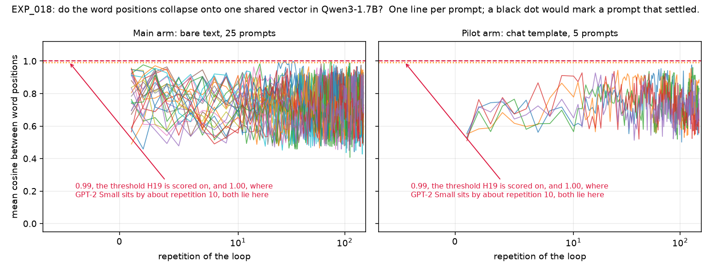
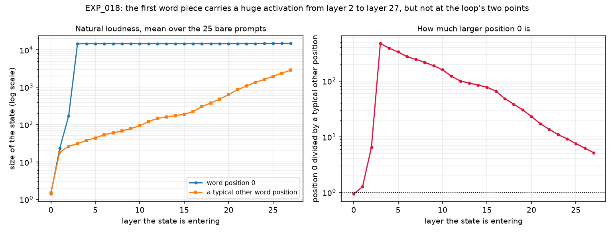
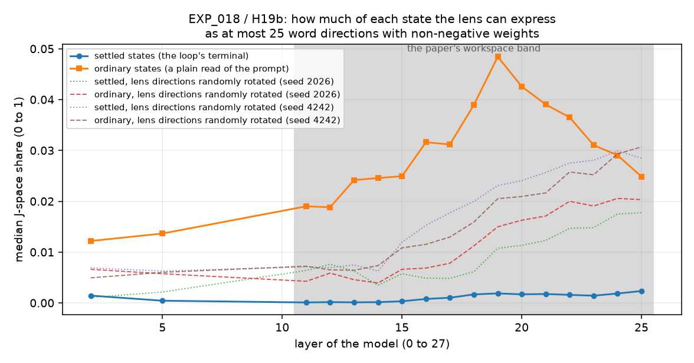

# EXP_018 results: the resonance loop on a small modern chat model

**Date:** 2026-09-05. **Session:** agent:exp018-chat-port. **Branch:**
`claude/latent-context-small-llms-u2jdig-exp018`. **Tracker:** issue #81.
**Specification of record:** `_STAGE2_JSPACE/EXP_018_SPEC.md`, committed before
the registered run. **Register rows:** EXP_018, H19, H19a, H19b, allocated
2026-09-05 under erratum (f) of `_STAGE2_JSPACE/REGISTER.md`.

---

## The answer

The loop does not do on a modern chat model what it does on GPT-2. Two of the
three registered hypotheses come out against the GPT-2 picture and the third
comes out for the loop being pushed outside the model's ordinary internal
vocabulary. **One thing needs the operator before this is final:** whether that
third hypothesis, H19b, is answerable at all on its pre-registered wording turns
on a word the specification uses in two different senses, and rule R8 reserves
that kind of resolution for the operator. The question, both readings of the
specification quoted in full, and what each would cost are set out under
"Decision 5" below. No measured number in this record changes either way.

Run in one sentence: the model is `Qwen/Qwen3-1.7B`, a 1.7-billion-number chat
model from 2025; the loop reads the model's internal running state at the exit
of its last layer, rescales it to the size that state naturally has where it
enters the first layer, feeds it back in there, and repeats, for 25 prompts at
up to 150 repetitions each, at natural loudness with the first word position
left out of the size measurement.

**A word about the word "settled".** The register's wording for H19 and H19b
speaks of the "settled tensor" and the "settled states", because on GPT-2 the
loop reaches a state it stops moving away from. Here it does not: no prompt
settled, as result 2 says. Everywhere below, the state being measured is the one
the prompt was on when the repetition cap was reached, which is what the
specification pre-registered as the thing to score ("at lock-in or at the cap").
The results files use `settled` as a field name for that state; read it as
"terminal" throughout. Nothing in this record claims a prompt converged.

**Result 1, the word positions do not end up merged, and never merge for
long.** On GPT-2 Small every word position of the state converges to one shared
direction by about repetition 10, which the project records as a mean pairwise
cosine of 1.0000 on a scale where 0 means unrelated directions and 1 means
identical ones. On Qwen3-1.7B that number ends at a median of **0.726** across
the 25 prompts, ranging from 0.483 to 0.929, and **not one of the 25 prompts
ends at or above 0.99**, which is the level the hypothesis is scored against.
Two prompts do cross it in passing and fall straight back: `F01_anger` is above
0.99 at repetitions 24, 27, 28, 32 and 33, reaching 0.997077, and is back at
0.729 by repetition 36 and 0.684 at the cap; `B03_moon` is above it at
repetitions 74 and 75, reaching 0.996001, and is back at 0.652 by repetition 76
and 0.846 at the cap. The tables below carry a second column for the same
measure taken over word positions 1 and later, leaving out the first position,
and on that second measure two further prompts cross 0.99 for a single
repetition each and nowhere else: `A03_neuro` at repetition 3 in the main arm,
reaching 0.992037, and `A08_linguistics` at repetition 128 in the pilot arm,
reaching 0.991633. H19 and every corrected sentence in this record are scored
on the all-positions measure, which is the one the hypothesis names, and no
prompt in either arm ends at or above 0.99 on either measure: the highest
terminal value anywhere is 0.929 over all positions and 0.966 leaving position 0
out, both in the main arm. Merging therefore happens in flashes on 2 of the 25
main-arm prompts as the hypothesis measures them, and on 4 of the 30 prompts
across both arms and both measures, and is never held. The measure does not
creep upward with repetition either: it oscillates around its own level for all
150 repetitions. **H19 is SUPPORTED on its registered wording**, which scores
the state the prompt ends on.

**Result 2, the loop never stops moving.** The convergence test asks whether the
average direction of the state now agrees with its direction two repetitions ago
to within a cosine of 0.999, three checks in a row. **Zero of the 25 prompts**
ever passed it inside 150 repetitions. The test statistic does get close and
then falls back: after repetition 100 its best value per prompt has a median of
0.9939 and a highest value anywhere of 0.9986, against the 0.999 it must exceed
and hold. The loop is circling rather than landing. **H19a is NOT SUPPORTED on
its registered wording.**

**Result 3, the terminal states sit further outside the model's expressible
directions than ordinary states do.** The J-space of a model, as the
"verbalizable workspace" paper defines it, is the set of internal states the
model can express as a positively weighted mix of at most 25 of its own word
directions, read through a Jacobian lens fitted for this model and published by
Neuronpedia. Ordinary states, the ones the model builds when it just reads the
prompt, keep a median of **3.1 percent** of themselves inside that set across
the workspace band, which is about **2.9 times** what the same measurement gives
when the lens directions are randomly rotated. The states the loop ends on keep a
median of **0.14 percent**, which is about **0.08 times** the randomly rotated
level. So those terminal states are not just outside the model's expressible
directions; they are further outside them than a random set of directions would
be. This holds at **15 of the 15 band layers**, each with a permutation p-value
of 0.0001, its smallest possible value with 10,000 draws, against the 8 of 15
the pre-registered rule required. **H19b is SUPPORTED on its registered
wording.** **That verdict word is now under a ruling request and should not be
swept into the register until the operator has ruled.** A review after this
record was written argued that the specification's pre-registered escape
clause, which makes H19b UNTESTABLE "if the lens file cannot be read or the
settled states cannot be produced", fires here, because 0 of 25 prompts passed
the convergence gate and so no state settled in the sense H19a defines. The
specification uses the word "settled" in two different senses in different
places and does not say which governs H19b, so this session has not decided it.
Both readings are quoted in full under "Decision 5" below, and the numbers in
this section do not change under either: what changes is only whether they are
the answer to the registered question or an exploratory reading beside it.

**One number worth the operator's attention on its own.** Under this project's
registered loudness convention, which holds the fed-back state at the size it
had where it was read out and measures that size and the natural one over the
whole tensor, every word position included, this model's loop would have been
injecting at an average of **2,039 times** the natural size of the entry it is
injected into, ranging from 1,402 to 2,702 across the 25 prompts. **Correction,
made after a review of the code:** this record first said 2,060 times, ranging
from 1,371 to 2,764. That was the same ratio measured this port's own way, with
the first word position left out of both sizes, which is not how the registered
convention measures it. The whole-tensor figures are the like-for-like ones and
are what this sentence now gives; the per-prompt tables below carry both.
The comparable committed figures are 218 times for GPT-2 Medium's full stack
and 73 times for GPT-2 Small's, measured by the registered engine, which takes
both sizes over the whole tensor in the same way. The committed control already
established that Medium's founding collapse to the letter "D" disappears at
natural loudness. Running this model at natural loudness from the first run,
which the reading note recommended, was not a refinement; on this architecture
the registered convention would have been an order of magnitude further from
natural than the case the project already treats as the apparatus question.

---

## What it means

**The founding picture is now conditional on the architecture, not just on the
loudness.** The project's central observation has been that the loop drives a
language model to a state in which every word position holds the same vector
and the readout says one word. That has been shown before to be conditional on
the loudness convention: at natural loudness on GPT-2 Medium's full stack, 0 of
25 prompts settled and the letter "D" appeared nowhere. This experiment adds a
second condition. On a model that re-applies word order inside every layer, the
positions never merge in a way that holds at natural loudness: 2 of the 25
prompts touch the 0.99 mark on a handful of repetitions out of 150, drop back
within one or two repetitions each time, and end the run at 0.684 and 0.846,
both below it. **Correction, made after a review of this record:** this
sentence first said the positions did not merge at all, at any point, which the
committed traces contradict, and that wording is withdrawn. Whether the
position scheme is the cause is **inferred, not established**: this port
changed the position scheme, the normalisation, the feed-forward shape, the
training budget and the vocabulary at once. The single experiment that would
separate them is named under "What remains" and costs one arm on a model the
project has already run.

**Not settling is not the same as chaos, and the difference is measurable.** A
supplementary observation, drawing no verdict and registered against no
hypothesis, ran three prompts again while keeping every step, and asked how well
the state agrees with itself k repetitions back, for k from 1 to 8. A state that has stopped
moving scores about 1.0 at every k; a state that alternates between two values
scores about 1.0 at every even k and lower at odd k; a state that wanders scores
below 1.0 everywhere. **Established from the committed artifacts:** that rerun
used the same precision and the same weights as the registered loop, because
its agreement values one and two repetitions back reproduce the loop's own
recorded values, for the same prompts over the same repetitions, to six decimal
places; for the first prompt one step back it is 0.624926 against the loop's
0.624926. The rerun is the same trajectory, not a second one. All three prompts
came out in between. Each of them agrees with itself better at even steps than
at odd ones, averaging 0.83, 0.93 and 0.84 at even steps against 0.68, 0.88 and
0.67 at odd steps, so there is a two-step alternation in the trajectory. But the
best agreement any of them reaches at any step is 0.90, 0.95 and 0.92, nowhere
near the 1.0 a real cycle would give. So the
loop is neither landing on a state nor closing into a repeating orbit: it is
circling in a small region with a two-beat rhythm. On GPT-2 Small this project
found a clean period-two cycle, whose lag-1 agreement sits at 0.685 forever while
its lag-2 agreement reads 1.0. This is not that.

**The readout has left language.** On GPT-2 Small the settled states decode to
English words; on GPT-2 Medium's full stack they decode to a single letter. Here
the last position at the cap decodes, across the 25 prompts, to just **9
distinct word pieces**, of which the commonest are the Chinese character for
"car" (7 prompts) and a newline (6 prompts), with the Japanese particles "の"
and "は", the Chinese character for "I", and two undecodable byte fragments
making up the rest. The distribution behind those choices is diffuse, but it is
not flat: the top word piece carries a median probability of 0.109, which is
about 16,553 times the 0.0000066 a flat distribution over the model's 151,936
word pieces would give it, and the spread of the whole distribution has a median
of 6.89 nats against the 11.93 nats of that flat distribution, which is the
spread of a flat choice among about 980 word pieces, 0.64 percent of the
vocabulary. So the model does have a preference at the state the loop ends on,
spread across roughly a thousand word pieces rather than concentrated on one.
What it does not do is what the loop does on GPT-2, where the settled state
decodes to one English word, and on GPT-2 Medium's full stack to a single
letter; whether those GPT-2 terminals were also sharper in probability, and not
only single-valued in what they decode to, is not measured here. **Correction,
made after a review of this record:** this paragraph first called the
distribution flat, said the model had almost no preference at all, and called
the reported word piece the tallest blade of grass in a flat field. All three
are withdrawn: a top word piece at about 16,500 times the flat level is a
preference, and what the numbers support is that the preference is spread wide,
not that it is absent. **This is an observation, not a hypothesis test**:
nothing was pre-registered about which word pieces would appear.

**The pilot arm says the chat wrapper changes the numbers but not the story.**
Wrapping the same prompts as a user turn, with the model's thinking mode
switched off, moves the merging metric from a median of 0.726 to 0.767 and
leaves the settling count at 0 of 5. Five prompts is a direction, not a
measurement.

---

## The registered hypotheses, scored on their registered wording

| Hypothesis | Registered statement, abbreviated | Pre-registered rule | Measured | Verdict |
|---|---|---|---|---|
| **H19** | In a rotary-position chat model looped at natural loudness with position 0 excluded from the norm, the token positions do not collapse to one vector: the mean pairwise cosine between positions of the settled tensor stays below 0.99, where GPT-2 Small reaches 1.00 by about iteration 10 | median terminal cosine below 0.99, scored at lock-in or at the cap | median **0.726**, range 0.483 to 0.929; 0 of 25 prompts at or above 0.99. Scored at the cap, because nothing locked in | **SUPPORTED** |
| **H19a** | At natural loudness the modern model's loop settles (lag-2 gate, cosine 0.999 sustained over three checks) on at least half of the run prompts within the iteration budget | 13 or more of 25 settle by repetition 150 | **0 of 25** | **NOT SUPPORTED** |
| **H19b** | The modern model's settled states have a lower J-space share on its pre-fitted lens than its ordinary prompt residuals at the same layer | settled median below ordinary median with permutation p below 0.05 at 8 or more of the 15 band layers | settled median below ordinary median at **15 of 15** band layers, all with p = 0.0001 | **SUPPORTED**, and this word is under a ruling request: see Decision 5 |

**The H19b verdict word is contested and is reserved for the operator.** The
row above says SUPPORTED because that is what the arithmetic gives once the
states the loop ends on are treated as the "settled states" the hypothesis
names. A review after this record was written argued that they are not, that no
state settled, and that the specification's own escape clause therefore makes
H19b UNTESTABLE. The specification can be read both ways, both readings are
quoted in full under "Decision 5", and nothing in this record or in
`REGISTER_VERDICTS.md` should be swept into the register until the operator has
ruled. No number moves either way.

Every verdict is scored on the wording the register carries, not on a wording
this session would have preferred. Two notes on what the verdicts do and do not
say. H19's threshold is a one-sided test and the measured median is far below
it, so the verdict does not depend on where in the 0.98 to 0.99 range the line
was drawn. H19a's "within the iteration budget" is doing real work: the budget
here is 150 repetitions, fixed in the specification before the run from the
measured cost of a repetition, and a longer budget is untested. What is
established is that the loop had not settled by repetition 150 on any prompt;
what is not established is that it never would.

---

## The run

| | Main arm | Pilot arm |
|---|---|---|
| Text | the prompt as written | the prompt as one user turn, thinking mode off |
| Prompts | 25, the whole registered Small subset, in file order | the first 5 of the same 25 |
| Word pieces per prompt | 8 to 17, 252 in total | 20 to 23, 107 in total |
| Repetition cap | 150 | 150 |
| Settled | 0 of 25 | 0 of 5 |
| Wall-clock time | 136.1 minutes | 60.4 minutes |
| Largest memory used | 3.85 gigabytes | 3.88 gigabytes |
| Natural loudness at the injection point, positions 1 and later | 4.47 units on average | 6.40 units on average |
| Position 0's share of that | 0.32 of the rest combined | 0.07 of the rest combined |

Every number in this record can be regenerated from the committed artifacts by
`python3 summarise.py`, which reads the results files and prints the tables
below without touching the model.

## What was run, and on what

**The model.** `Qwen/Qwen3-1.7B`, the public post-trained chat model released
in 2025, downloaded from the Hugging Face hub with no authentication token.
**Established from this machine's model cache:** the exact files are hub
revision `70d244cc86ccca08cf5af4e1e306ecf908b1ad5e`, meaning one named version
of a model's files on the hub, and it is the only version of this model on the
machine, so every stage that read the weights read the same ones. It
has 28 layers, a running internal state 2,048 numbers wide per word piece, 16
attention heads sharing 8 sets of keys and values, a vocabulary of 151,936 word
pieces, and about 1.72 billion numbers of its own that it learned during
training. It encodes word order by rotating its internal queries and keys
inside every layer, normalises by size alone rather than by size and centre,
and multiplies two projections together inside each non-attention block. GPT-2,
the model every earlier result in this project was measured on, does none of
those three things and saw roughly three thousand times less training text.

The reading note's first choice, Gemma-3-270M, could not be used: it is
licence-gated and the hub returns HTTP status 401, meaning "not authorised",
without a token, and this environment has none. Qwen3-1.7B was chosen because
it is public, is supported by TransformerLens 3.8.1 under its own name, and has
a Jacobian lens already fitted and published for it.

**The instrument.** The Jacobian lens published by Neuronpedia at
`neuronpedia/jacobian-lens`, path `qwen3-1.7b/jlens/Salesforce-wikitext`, whose
SHA-256 fingerprints are recorded in the specification. **Established from the
downloaded fit record:** the lens was fitted on `Qwen/Qwen3-1.7B` itself, that
is on the chat model and not on a base variant, on 2026-06-11, from WikiText-103
(English Wikipedia articles) at 128 word pieces per prompt. It was budgeted for
1,000 prompts and stopped itself at 466 when its own convergence criterion was
met, with a final mean relative change of 0.0018 on a scale where 1.0 would mean
the lens changed completely with the last prompt added. It carries fitted
matrices for layers 0 through 26 of the 28; the last layer is absent, which is
expected, because that layer's lens would be the identity by construction.

**Versions.** Python 3.11.15, torch 2.14.0 (CPU build), transformers 5.16.1,
transformer_lens 3.8.1, jlens 0.1.0 at pinned commit
`581d398613e5602a5af361e1c34d3a92ea82ba8e`, numpy 2.4.6, scipy 1.17.1. One CPU
thread throughout, because multi-threaded linear algebra was previously measured
five times slower on this machine.

## The deviations, stated flat

**D1: the model runs in bfloat16, not float32.** bfloat16 is a 16-bit number
format carrying about three decimal digits; float32 carries about seven. The
reading note recommends float32 for a loop that runs hundreds of passes. It does
not fit here. The registered loading route,
`HookedTransformer.from_pretrained`, reached 13.9 gigabytes of memory and was
killed by the operating system; the newer bridge loader's compatibility mode,
which folds the normalisation weights the same way, reached 10.5 gigabytes and
was killed; the bridge loader without compatibility mode peaks at 3.89
gigabytes in bfloat16 and 10.98 gigabytes in float32, against a 9-gigabyte
ceiling for this session on a machine with 15 gigabytes shared with three other
agent sessions. Every operation the loop itself performs is carried out in
float32: the extraction, the rescale, the convergence gate's cosine
comparisons, the positions-merged metric, and the readout. Only the model's own
internal arithmetic and the injected tensor's storage are bfloat16.

What that can and cannot do, stated before the results are read. The injected
tensor is rounded to bfloat16 once per repetition, which moves its direction by
a relative amount of about 0.002, so two states differing only by that rounding
would have a cosine of about 0.999997, far above the 0.999 the convergence gate
asks for. The gate is therefore not at risk from rounding. What rounding can do
is move the trajectory: the map being repeated is not linear, so a perturbation
of 0.2 percent per step can in principle land a prompt somewhere else after a
hundred and fifty steps. That is a real limit on the individual terminal word
pieces reported below, and it is inferred from the arithmetic rather than
measured. It is a weaker limit on the two aggregate results, because those turn
on whether the word positions merge and on whether the loop stops moving at all.

**D2: the repetition cap is 150, not the 300 the session brief proposed.** At
the measured 2.19 seconds per repetition, 25 prompts at 300 repetitions would
need about 4.6 hours of the six-hour budget on their own, leaving no room for
the rest of the work. The cap was fixed at 150 in the specification before the
run. Section "What the cap did" reports whether it bound.

**D3: the convergence gate is checked every 2 repetitions from repetition 10,
not every 10 from repetition 100.** At a 150-repetition cap the registered
schedule would allow at most 6 checks and could not report a lock-in before
repetition 120. The finer schedule is the one the registered `settle` tier of
EXP_010c-3b already uses, for the same reason.

**D4 was reserved for the fallback model, `Qwen/Qwen2.5-0.5B-Instruct` with a
lens fitted in-house. It was not needed and did not happen.**

**D5: the loading route itself is a deviation.** Every earlier experiment in
this project loaded its model with `HookedTransformer.from_pretrained`, which
rewrites the model's weights into a canonical form. This run uses
TransformerLens 3.8.1's bridge loader without that rewriting, because the
rewriting does not fit in memory. Two round trips verify that this changes
nothing about where the loop reads and writes. Reading the state at
`blocks.27.hook_resid_post` and decoding it through `ln_final` and `W_U`, the
readout convention of the registered engine, reproduces the model's own output
scores exactly, to a largest absolute difference of 0.0 on scores whose largest
magnitude is 29.1. Writing the recorded natural state back into
`blocks.0.hook_resid_pre` reproduces the model's own output scores exactly, to a
largest absolute difference of 0.0. Writing a deliberately wrong state there,
the same tensor with its word positions reversed, moves those scores by 24.75,
most of their range. So the injection point is exactly the layer-0 entry, the
extraction point is exactly the last layer's output, and a hook that overwrites
the state really does change what the model says.

**One incident, recorded because it is the kind of thing this project's rules
exist to catch.** The pilot arm was launched with a runner whose prompt-count
default applied only to the probe stage, so it began working through all 25
prompts instead of the 5 the specification fixes. The bug was noticed after the
first pilot prompt, the runner was corrected, and the running process was
stopped after its fifth prompt, which its per-prompt checkpointing makes clean.
The committed pilot arm is therefore exactly the 5 prompts the specification
names, in the specified order, run with the specified parameters. Nothing about
the main arm was affected. A second bug was caught before it could run at all:
the stage that produces the per-layer states for H19b would have injected the
terminal tensor at its own size, about two thousand times the natural entry
loudness, instead of at the loudness the loop itself uses. That is recorded in
the commit history at `80c259d`.

**Six faults found in a review of the code after the run, and what each one
changes.** A review of the harness after the results were written found six
faults in it. Two of them change what this record prints and are corrected in
the sections below that report them; the other four are in code paths this run
did not take, or took by hand, and are fixed for later runs. No hypothesis
verdict moves, and nothing was re-run to make these corrections, because
re-running any stage that touches the model needs the weights and hours of
machine time.

1. The table generator printed only one of the two conditions of the
   approximation check named in deviation D6, because the line that prints sat
   outside the loop over conditions and reported whichever condition the file
   listed last. The appendix below now carries all four lines. The largest
   disagreement between the restricted search and the unrestricted one is on
   the terminal states, at 0.000675 at layer 11 and 0.003109 at layer 18 on a
   share that runs from 0 to 1, against 0.000422 and 0.001302 on the ordinary
   states. The figure of 0.0031 quoted in the H19b section before this
   correction was the terminal number at layer 18 and is right, but that
   section did not say which condition it belonged to and the table under it
   showed only the ordinary condition. Both now say so.
2. The field `final_cos_mean_lag2` in the two probe files is wrong: it reads
   1.0 in both. That field is meant to hold the last measured agreement between
   the state now and the state two repetitions back, on a scale where 1.0 means
   the state has stopped moving altogether. The loop updated it only on
   scheduled convergence checks, and the probe stage schedules none, so the
   placeholder the loop starts from survived into the file. **Established from
   the traces inside those same two files:** the correct value is the last
   entry of the trace, which is 0.915891 for the bare arm and 0.908719 for the
   chat arm in `probe_natural_norms_float32.json`, and 0.976165 and 0.924489 in
   `probe_natural_norms_bfloat16.json`. The probe files are left exactly as
   they were run and are not edited by hand; the loop code now records the last
   measurement at every repetition, so later runs carry the right number.
   Nothing in this record rests on that field, and the two registered arms are
   unaffected: in all 30 prompt records their reported value already equals the
   last entry of their own trace, because their 150th repetition falls on a
   scheduled check.
3. The probe stage wrote one filename whichever precision it ran in, so the
   second of the two probe runs overwrote the first and the two committed files
   were renamed by hand afterwards. The stage now writes the precision into the
   filename, so it produces the two names that are committed.
4. The loop stage counted a prompt as finished, when resuming, if its row was
   in the results file, whether or not its terminal state had reached the state
   file, and it wrote both files in place. A prompt interrupted between the two
   writes would have been skipped for ever and would have stopped the states
   stage later with a missing state. A prompt now counts as finished only when
   both files hold it, and each file is written under a temporary name and then
   renamed, which replaces it in one step. **This run was not affected, checked
   here:** every row in each results file has its terminal state in the
   matching state file, 25 of 25 in the main arm and 5 of 5 in the pilot arm.
5. The states stage loaded the model in float32 unless told otherwise, while
   this run's loop ran in bfloat16, so the documented regeneration command
   would have rebuilt the states in the wrong precision. That stage now takes
   the precision from the results file and refuses a flag that contradicts it.
   **Established from the run logs:** the committed states were produced in
   bfloat16, whose largest memory use was 3.88 gigabytes, against the 10.98
   gigabytes the same load measured in float32.
6. The J-space stage chose the model's weight files by sorting the cache
   directory and taking the last name, which orders versions by their
   identifiers and not by which one a run used. It now reads the version the
   run recorded, or, when the run recorded none as is the case here, the cache
   pointer an ordinary load follows, and it stops with a message naming the
   directory rather than guessing between versions. **This run was not
   affected:** this machine holds exactly one version of the weights, so the
   old rule and the new one name the same files.

**Six further faults found in a second review of the code, and what each one
changes.** A second review of the same code found six more faults. One of them
changes a number this record put in front of the operator, and that number is
retracted by name below; the other five are in code paths the registered run
did not take, and are fixed for later runs. Nothing was re-run for these
either.

1. **The loudness figure this record led with was not measured the way the
   registered convention measures it, and is retracted.** This record said that
   the registered convention would have injected at 2,060 times the natural
   entry loudness on the 25 bare prompts, ranging from 1,371 to 2,764, and set
   that beside 218 times for GPT-2 Medium and 73 times for GPT-2 Small. As a
   comparison that was wrong. The figure of 2,060 leaves the first word
   position out of both sizes, which is this port's own convention, while the
   registered engine measures both sizes over the whole tensor, which is how
   the GPT-2 figures were measured. Recomputed from the committed results files
   the like-for-like figure is **2,039 times on average, ranging from 1,402 to
   2,702**; on the five chat prompts it is 1,899 on average, ranging from 1,780
   to 2,010, where the position-0-excluded figure was 1,824, ranging from 1,690
   to 1,944. Nothing else moves, because the two ways of measuring differ by
   about 1 percent of each other and the comparison with 218 and 73 was never
   close. Both numbers now appear in the per-prompt tables and in the summary
   under each of them, and the table generator computes both.
2. The states stage resolved the weights by the cache pointer instead of the
   revision the loop recorded. If the pointer moved between the loop and that
   stage, the saved terminal tensors would have been run through different
   weights, and the metadata written afterwards would have recorded the new
   revision and hidden the mismatch. The stage now pins its load to the
   revision the loop recorded and names any disagreement with the pointer.
   **Verified here:** a load pinned to revision
   `70d244cc86ccca08cf5af4e1e306ecf908b1ad5e` returns the model this experiment
   used, 28 layers and a state 2,048 numbers wide, in 14.7 seconds at a largest
   memory use of 1.69 gigabytes.
3. The loop stage's resume matched saved work by prompt name alone, so
   resuming after a change of precision, weights, repetition cap, check
   schedule or seed would have put records made under two settings into one
   file labelled with only the second. A resume now compares the precision, the
   weights revision and every loop parameter against the saved file and stops
   on any contradiction, naming the field that differs. What the saved file
   does not record cannot be compared and is reported rather than assumed to
   agree. The committed command in `_run_all.sh` still resumes cleanly, checked
   here against the committed results file.
4. The loop accepted a check schedule that begins before the comparison it
   makes exists. With checks from repetition 1, the first check compares the
   state with the one immediately before it while calling it a two-repetition
   comparison, and that malformed value could count towards the three
   consecutive passes the convergence gate needs. The loop now enforces the
   rule the registered engine enforces, that checks may not start before the
   lag. **The committed runs satisfy it:** both arms checked from repetition 10
   with a lag of 2, and the probe scheduled no checks at all. The committed
   trace shows what the rule prevents: at repetition 1 the one-repetition and
   two-repetition agreements are the same number, 0.251262 for the first bare
   prompt, because both compare with the state the loop started from.
5. The lag scan now takes its precision from the results file, pins its weights
   to the revision the loop recorded, and writes both into its own artifact,
   which recorded neither before. It reruns the trajectory rather than reading
   a saved one, so it has to match the loop it describes. **The committed lag
   scan was not affected, established here:** its agreement values reproduce
   the loop's own recorded values to six decimal places, so it ran the same
   bfloat16 arithmetic on the same weights, and that is now stated beside the
   lag-scan result above. The review asked whether it had been run in float32.
   It had not.
6. `_run_all.sh` printed each command as it ran but did not stop on failure, so
   a failed arm still let the script write "ALL LOOPS DONE" and still exit with
   a success status. It now stops at the first failure and exits with that
   command's status, checked here with a stand-in command that fails: the old
   form exits 0 and writes the completion line, the new form exits 1 and writes
   nothing.

**Six findings from a third review, four of them in what this record says, one
in the runner and one in a figure, and what each one changes.** A third review,
this time of the record and the figures as well as the code, found six more
faults. All six are real. Four of them change sentences this record put in front
of the operator, and each of those sentences now carries its correction with the
old wording or number withdrawn by name; no hypothesis verdict moves. Nothing
that needs the model weights was re-run: the loudness figure was rebuilt from
the committed probe file and the per-prompt tables from the committed results
files, both without loading the model.

1. **The documented way to regenerate the per-layer states loaded unpinned
   weights, and the stage now refuses to.** That stage takes the terminal tensor
   each prompt ended on, feeds it back into the model and reads every scored
   layer, so it has to use the weights that produced those tensors. The second
   review's item 2 above pinned its load to the revision the loop recorded,
   meaning the 40-character identifier of one exact version of the model's files
   on the Hugging Face hub. **Established from the committed artifacts:** neither
   `output/results_bare.json` nor `output/results_chat.json` carries a
   `model_revision` field at all, because both were written before the runner
   recorded it, so that fix always fell through to its fallback, which followed
   the machine's cache pointer `refs/main` and then wrote whatever version that
   named into the metadata beside the regenerated states. On a machine whose
   pointer had moved, the documented command would have run this run's terminal
   tensors through different weights and labelled the result with the new
   version. The stage now stops with a message naming the missing field, takes a
   `--revision` option and pins its load to it, and the regeneration command in
   "Artifacts" below passes this run's revision,
   `70d244cc86ccca08cf5af4e1e306ecf908b1ad5e`. The loop, probe and lag-scan
   stages take the same option, so a future run can pin from the start. **Nothing
   was written into the committed results files**, because this run's revision is
   established from this machine's model cache holding exactly one version of the
   weights, and not from anything the run itself recorded; putting it in the
   artifacts now would present an inference as a measurement. Those two files
   predate the field, and the record says so where it gives the command.
2. **Layer 18's two J-space medians were the across-band medians, and are
   corrected.** The H19b section said that layer 18 was typical at ordinary
   0.031 and terminal 0.0016, a factor of about 20. Those are the medians taken
   across the whole band, which the sentence before it had just given.
   **Established from `output/jspace_shares_bare.json` and the table below,
   which agree:** layer 18's own medians are 0.03894 for the ordinary states and
   0.00167 for the terminal ones, a factor of about 23, on a share that runs
   from 0 to 1. The old numbers are withdrawn and the ratio is recomputed.
3. **The lens was fitted on 466 pieces of text, not a thousand.** The H19b
   section described the lens as averaged over a thousand ordinary pieces of
   text. The fit was budgeted for 1,000 prompts and stopped itself at 466 when
   its convergence criterion was met, which this record already states two pages
   earlier and which the committed analysis carries as `lens_n_prompts` = 466.
   The sentence now says 466 WikiText-103 prompts of 128 word pieces each, and
   "a thousand" is withdrawn. Nothing else in this record or in
   `REGISTER_VERDICTS.md` makes the same overstatement: the other mentions of
   1,000 are the GPT-2 tiers' repetition cap, which is a different number.
4. **The terminal distribution was called flat, and that description is
   withdrawn.** The record said the readout distribution was flat and that the
   model had "almost no preference at all". **Established from the committed
   results files:** the median top-word-piece probability is 0.109, about 16,553
   times the 0.0000066 a flat distribution over the model's 151,936 word pieces
   would give, and the median spread is 6.89 nats against that flat
   distribution's 11.93 nats, which is the spread of a flat choice among about
   980 word pieces, 0.64 percent of the vocabulary. A distribution concentrated
   on a thousandth of the vocabulary is diffuse next to a settled GPT-2 state
   that decodes to one word, but it is not flat. The paragraph now says diffuse
   and gives both baselines, the per-prompt tables carry the same two baselines,
   and `summarise.py` computes them, so the tables regenerate as printed.
5. **"The positions never merged at any point" was too strong, and is
   withdrawn.** The record said the positions did not merge at all, at any point
   in 150 repetitions. **Established from the committed traces in
   `output/results_bare.json`:** two prompts cross the registered 0.99 merge
   threshold in passing, `F01_anger` at repetitions 24, 27, 28, 32 and 33 with a
   highest value of 0.997077, and `B03_moon` at repetitions 74 and 75 with a
   highest value of 0.996001. Both fall back within a repetition or two, to
   0.729 and 0.652 respectively, and end the run at 0.684 and 0.846. The
   pre-registered verdict is unaffected, because H19 is scored on the state each
   prompt ends on and 0 of 25 end at or above 0.99. The record now says that
   merging is never sustained rather than that it never happens, and the figure
   caption says which two lines touch the line and where. Both counts here are
   on the measure taken over all word positions, which is the one H19 names;
   result 1 above records the two further prompts that cross 0.99 on the
   position-0-excluded measure the tables carry beside it.
6. **The loudness figure stopped one hook short of the loop's extraction point,
   and now carries it.** `make_figures.py` plotted the entry to each of the 28
   blocks, `blocks.<l>.hook_resid_pre`, so its last point was the entry to block
   27 and not the loop's extraction point, the exit of block 27,
   `blocks.27.hook_resid_post`. The caption nonetheless said the loop reads and
   writes at the two ends of the curve. **Established from the committed probe
   file, which holds both:** the mean ratio of the first word position to a
   typical other position is 5.18 at the plotted entry to block 27 and 0.84 at
   the omitted exit, on the 25 bare prompts. The figure now draws the exit as a
   separate final point, marks both of the loop's own points, and names all
   three numbers; the caption and this record's description of the curve are
   rewritten to match. The rebuild reads only the committed probe file and runs
   no model.

**Three findings from a fourth review, on 2026-09-06, all of them in the code,
and what each one changes.** A fourth review, of the code as it stood after the
third round of fixes, found three faults. All three are real. All three are in
code paths the registered run did not take, so no hypothesis verdict moves and
no number this record prints changes. Nothing was re-run for them, because every
stage that touches the model needs the Qwen3-1.7B weights and hours of machine
time; each fix was instead exercised against doctored copies of the committed
files in a scratch directory, which does not load the model.

1. **A resume could have finished an arm on one version of the weights and
   labelled the whole file with another.** The runner's resume compares the
   precision, the weights revision and every loop parameter of a saved results
   file against the invocation resuming it, and stops on any contradiction, which
   is the second review's item 3 above. A field the saved file does not carry
   cannot contradict anything, so a missing weights revision only printed a note
   and the run carried on. **Established from the committed artifacts:** neither
   `output/results_bare.json` nor `output/results_chat.json` records a
   `model_revision` at all, so both are in exactly that state. Had a prompt been
   missing from the terminal-state archive while this machine's cache pointer had
   moved on to a newer version of the model's files, that one prompt would have
   been rerun on the newer weights, its record combined with the 24 made on the
   older ones, and the file stamped with the newer revision as though all 25 had
   been made there. The runner now refuses such a resume unless
   `--assume-legacy-revision` names the version the existing records were made
   on; it then pins its own load to that version and writes it into the file
   marked as assumed rather than recorded, so the file never claims to have
   measured something an operator asserted. A resume of a file that does record
   a revision now pins its load to that revision as well, so the prompts still
   to run go through the same weights as the ones already in the file; before,
   the run loaded whatever the machine's pointer named and then refused if the
   two turned out to differ, which wasted the load and could not help a machine
   whose pointer had moved. **The committed run was not affected:** both arms
   are complete, 25 of 25 records in the main arm and 5 of 5 in the pilot arm
   have their terminal state in the matching archive, so no prompt was ever
   rerun. **What this means for the resume command in
   `_run_all.sh`:** run against the committed files it still does nothing and
   still writes nothing, because there is no prompt left to run, and that is
   checked here; a resume of an incomplete arm made from these two files would
   stop and ask for `--assume-legacy-revision
   70d244cc86ccca08cf5af4e1e306ecf908b1ad5e`, this run's revision, which remains
   inferred from this machine holding exactly one version of the weights rather
   than established from anything the run recorded. The script now carries that
   sentence as a comment.

2. **The J-space stage read the lens file without checking it was the lens the
   specification names.** The Jacobian lens, the third-party set of matrices
   through which every H19b number is measured, is downloaded into
   `_STAGE2_JSPACE/artifacts/`, which repository convention leaves unversioned,
   so nothing committed in this repository could vouch for the copy on any given
   machine. Section 2 of the specification fixes the lens file's SHA-256
   fingerprint, the standard 64-character summary of a file's exact contents, and
   the stage ignored it, so a truncated download or a later re-fit published
   under the same name would have changed every share with nothing to show for
   it. The stage now computes that fingerprint before it reads a single tensor,
   refuses any file that does not match, and writes the fingerprint into its own
   output beside the numbers it produced. **Verified on this machine:** the lens
   file here fingerprints to
   `6fcc79011bd921ffd87612255e2e99950a124fa519470ee44ebaf161c39be9d6`, which is
   character for character the value the specification fixes, so the committed
   H19b numbers were measured through the registered instrument. **The committed
   J-space artifacts predate the field:** `output/jspace_shares_bare.json` and
   `output/jspace_shares_chat.json` carry no fingerprint and no weights revision,
   because both were written before either was recorded, and neither file was
   edited to add one, for the same reason the results files were left alone in
   the third review's item 1, that writing a value found today into an artifact
   written yesterday presents a later check as part of the run.

3. **A hand-given weights revision could override what the run recorded, on the
   stage where the two must agree.** The J-space stage reads two things out of
   the model's weight files, the unembedding matrix, meaning the matrix that
   turns an internal state into a score for every word piece, and the gain of the
   final normalisation, and multiplies them into the lens directions that score
   states an earlier stage produced. Those states came out of one exact version
   of the weights, so both halves of the multiplication have to come from that
   same version. The stage took `--revision` as its first authority without ever
   comparing it against the `model_revision` and `loop_model_revision` the states
   stage records, so a mistyped or stale identifier would have scored one
   version's states against another version's unembedding and labelled the
   result with the second alone. It now checks an explicit revision against every
   revision an earlier stage recorded and stops on any disagreement, which is the
   rule the states runner has followed since the second review's item 2. Two
   further changes follow from it. First, when no earlier stage recorded a
   revision, `--revision` is now required and the output marks it assumed rather
   than recorded; **this withdraws the fallback described in item 6 of the first
   review above**, which let the stage follow this machine's cache pointer
   `refs/main` when the run recorded nothing, and that pointer can name weights a
   run never used. Second, a stage handed its revision by hand now records that
   fact in its own metadata, so the stage after it reads an assumption as an
   assumption rather than as a measurement. **The committed run was not affected,
   established here:** this machine holds exactly one version of the Qwen3-1.7B
   weights, `70d244cc86ccca08cf5af4e1e306ecf908b1ad5e`, and the cache pointer
   names that one, so the old rule and the new one read the same files.

**Three findings from a fifth review, on 2026-09-06, all of them in the code,
and what each one changes.** A fifth review, of the code as it stood after the
fourth round of fixes, found three more faults. All three are real. All three
are about how the harness behaves on a later machine or after an interruption,
not about anything the registered run computed, so no hypothesis verdict moves
and no number this record prints changes. Nothing was re-run for them; each fix
was exercised against doctored copies of the committed files in a scratch
directory, which loads no model.

1. **A rerun of a finished arm still loaded the model, so it could fail on a
   machine that has the results but not the weights.** The fourth review's item
   1 above made a resume with nothing left to run exit without writing anything,
   which it did, but it exited after loading the model rather than before.
   Rerunning the two commands in `_run_all.sh` therefore loaded 3.4 gigabytes of
   weights twice, once per arm, to discover that there was nothing to do, and it
   would have failed outright on a machine without the weights, without
   `transformer_lens` and `torch` installed, or without the memory to hold the
   model, even though the answer was already on disk. The runner now validates
   the finished checkpoints and returns before the load. **Established here:**
   with the load replaced by a stand-in that records being called, the committed
   command runs the arm to completion with the stand-in called zero times, and
   the two files in the output directory come back byte for byte identical, so
   the early exit changes what the command costs and never what it writes. What
   is no longer compared in that case is the weights revision, because there is
   no load to compare against, and the run says so in a printed line instead of
   passing over it.

2. **A branch or tag name was accepted where a commit identifier was meant, so
   a moving name could defeat every revision check.** The harness records a
   weights revision as one string and compares those strings across stages. It
   accepted whatever string was passed, so `--revision main` would have been
   recorded as `main`, and `main` names whatever was published under it at the
   moment of each load. Two stages could then both record `main`, agree on it
   character for character, and have read different weights, which is the exact
   failure the revision checks added in the second, third and fourth reviews
   exist to catch. Every revision the harness accepts or records is now required
   to be a commit identifier, meaning the 40 lowercase hexadecimal characters
   naming one exact commit, which cannot move; `--revision` and
   `--assume-legacy-revision` are both checked before any stage runs, and the
   loader, the resolver and the weight-file reader check again so no path can
   slip past. The refusal names the pointer files on the machine so the operator
   can look the commit up. **The committed run was not affected, established
   here:** the revision it is labelled with,
   `70d244cc86ccca08cf5af4e1e306ecf908b1ad5e`, is already a commit identifier
   and passes the new check unchanged.

3. **The two halves of the per-layer state set were published one at a time, so
   an interruption between them could pair new tensors with old metadata.** The
   states stage writes an archive of tensors and a metadata file naming the
   weights those tensors came out of, and the J-space stage reads the revision
   from the metadata and the tensors from the archive. Written one after the
   other in place, a crash between the two writes would have left the new
   archive beside the previous run's metadata, and the J-space stage would then
   have scored the new states through the old revision's unembedding matrix,
   meaning the matrix that turns a state into a score for every word piece, and
   labelled the answer with the old revision. Both halves now carry the same
   one-use generation stamp, a stamp being an identifier that says which run
   published a file; both are written under names specific to that run and
   renamed only once both are complete; and the J-space stage compares the two
   stamps and refuses a pair that disagrees, including a pair where only one
   half carries a stamp. **What the pair on this machine carries:** nothing, in
   either half, because it was written before the stamp existed. That is
   accepted with a printed note saying the check could not be made, and the
   output records the absence rather than an agreement, which is the same rule
   the record follows everywhere else about not presenting a later check as part
   of an earlier run. That pair is not committed in any case: the state
   directory is excluded by `_STAGE2_JSPACE/.gitignore`, and every reader
   rebuilds it from the committed terminal states with the command under
   "Artifacts" below, which writes a stamped pair.

**Two findings from a sixth review, on 2026-09-06, one of which asks the
operator a question rather than answering it.** A sixth review found two more
faults. Both are real. One of them is about a verdict and is not this session's
to settle, so it is filed as a ruling request rather than acted on; the other is
in the code and is fixed. Nothing was re-run, and no measured number in this
record changes.

1. **Whether H19b is answerable at all on its pre-registered wording is a
   question this session cannot settle, and it is now in front of the
   operator.** H19b is scored on "settled states", and the specification's
   verdict rule ends "UNTESTABLE if the lens file cannot be read or the settled
   states cannot be produced". Zero of the 25 prompts passed the convergence
   gate, so nothing settled in the sense the gate defines, and what this record
   scored are the states each prompt was on at the 150-repetition cap. The
   review argued that the escape clause therefore fires and that the verdict
   should be UNTESTABLE. **Established from the specification, which was read
   in full for this:** it uses the word "settled" in two different senses in
   different places. Its H19b passage never carries the phrase "at lock-in or at
   the cap" that its neighbours carry, which supports the review; its artifact
   list calls the cap tensors "the settled tensors" and its H19b procedure
   points at exactly that artifact, which supports what this record did. Both
   readings are quoted in full under "Decision 5" above. **No verdict word was
   changed and none should be until the operator rules**, because rule R8
   reserves a resolution like this for a human and the specification does not
   decide it. The H19b row in `REGISTER_VERDICTS.md` now carries a hold notice
   in front of the verdict this session scored, and that file must not be swept
   into the register until a comment beginning `TC-RULING:` says which reading
   governs. What is not in doubt either way: every number in the H19b section is
   the same under both readings, because both score the same states; what a
   ruling decides is whether those numbers answer the registered question or sit
   beside it as an exploratory reading.

2. **The loop's two checkpoints were published independently, so a rerun prompt
   could end up as a new tensor beside an old row.** The loop writes a results
   file holding one row per finished prompt and an archive holding one terminal
   tensor per finished prompt, and a resume decides what is finished by matching
   prompt identifiers across the two. The fifth review's item 3 above gave the
   per-layer state pair a shared generation stamp, meaning a one-use identifier
   that says which publication produced a file, but left the loop's own pair
   without one. Identifiers alone are not enough there. A prompt whose row
   exists but whose tensor does not is rerun, and if the archive write lands
   while the results write does not, the next resume finds the identifier in
   both files, calls the prompt finished, and keeps a row describing the first
   computation beside a tensor from the second. The two are now published as one
   generation: both carry the same stamp, both are written under names specific
   to that publication, and neither replaces its target until both are complete.
   A resume compares the two stamps and refuses a pair that does not match, and
   so does the states stage, which reads the same pair. **What the committed pair
   carries:** nothing, in either half, because both files were written before the
   stamp existed. A resume of an unstamped pair says so in a printed line and
   falls back to matching prompt identifiers, which is exactly what it did
   before, and anything a loop invocation writes from now on carries a stamp.
   **The committed run was not affected:** no prompt in either arm was ever
   rerun, because every row in each results file has its terminal state in the
   matching archive, 25 of 25 in the main arm and 5 of 5 in the pilot arm, which
   the fourth review already established and this session rechecked.

**D6: the J-space search is restricted after one full pass.** The vocabulary
has 151,936 entries, so after computing every direction's correlation with the
state once, the search for the best 25 keeps only the 4,096 best-correlating
directions. The size of that approximation is measured rather than assumed, and
is reported in the H19b section.

## What the port taught about the harness conventions

The reading note listed six hazards a port would have to handle. Four of them
bit, and two of them bit in a way the note did not predict. Each is reported
against the note's own numbering (`docs/LATENT_CONTEXT_NOTE_2026-09-04.md`
section 4.2, in the lucier repository).

**Hazard 1, rotary positions, bit as predicted and is the likeliest cause of
the headline result.** In GPT-2 the injection at layer 0 overwrites the word
vectors and the position vectors together, so from the first repetition onward
the prompt survives only as a length, and every word position is fed the same
kind of thing. In Qwen3 the position is re-applied inside every attention
layer, so the injected state stays position-aware forever: position 5 is
treated as position 5 on every one of the hundred and fifty repetitions. The
note called it speculation that the merging of positions this project sees on
GPT-2 would not occur in a rotary model. It did not occur. That is consistent
with rotary positions being the cause, but it is not proof of it, because this
port changed four things at once: the position scheme, the normalisation, the
feed-forward shape, and the loudness convention. Isolating the cause needs a
separate experiment and is listed under "What remains".

**Hazard 2, the loudness convention, bit hard, and the massive first-token
activation the note warned about is real but sits somewhere the note did not
expect.** Two separate findings.

First, the size of the shout. Under this project's registered convention the
fed-back state is held at the size it had where it was read out, deep in the
network, and both that size and the natural one are measured over the whole
tensor. Measured here, on the 25 bare prompts, that size averages
**2,039 times** the natural size of the layer-0 entry it is injected
into (range 1,402 to 2,702 across prompts); this record first gave the figures
measured with position 0 left out, 2,060 and 1,371 to 2,764, which are not
like for like with the registered convention. The comparable committed figure
for GPT-2 Medium's full stack is 218 times, and for GPT-2 Small 73 times. So the
registered convention on this model would have been an order of magnitude more
extreme than the one the operator report already identifies as the apparatus
question. Running at natural loudness from the first run, which is what the
note recommended and what this experiment did, was the right call by a wide
margin.

Second, where the first word piece is huge. The note predicted, from the
literature on massive activations, that position 0 would carry activations
hundreds to thousands of times larger than the rest and would therefore
dominate any whole-tensor rescale. Measured here across all 28 layers, that is
true in the middle of the network and false at both ends. At the entry to layer
0, the injection point, position 0 is 0.9 times the size of a typical other
position, which is entirely ordinary. One layer later it is 1.3 times. Then it
explodes: 6.5 times at the entry to layer 2, **474 times** at the entry to
layer 3, and it stays enormous for most of the stack, 334 times at layer 5, 122
times at layer 11, 77 times at layer 15, 23 times at layer 20, and 5.2 times at
the entry to the last layer. At that last layer's output, the extraction point,
it is back to 0.84 times a typical position: the final layer undoes it.
**Correction, made after a review of the figures:** this record first gave that
last figure as 0.96 times. That is the value in the float32 feasibility probe,
while every other number in this paragraph, and the figure below, comes from
the bfloat16 probe, which is the precision the registered loop ran in. The
like-for-like figure is therefore 0.84 and 0.96 is withdrawn. The two probes
agree to within 0.9 percent of each other at every one of the 28 block entries
and differ by 12 percent only here, at the exit of the last block. **Inferred,
not established:** the exit of block 27 is where the last block removes most of
the first position's activation, from about 14,800 units at its entry to about
2,500 in bfloat16 and about 2,850 in float32, and a cancellation of that size
is where a 16-bit number format's coarser rounding would show first.

The loop touches the state only at those two ends, so excluding position 0 from
the rescale changed the loudness by about 5 percent rather than by the two
orders of magnitude the note anticipated: the whole-tensor size at the
injection point averages 1.051 times the size over positions 1 and later. The
exclusion was therefore a correct safety measure that turned out not to be
load-bearing here. It would have been load-bearing for any window that read or
wrote between layers 3 and 20, which is where this project's flagship GPT-2
windows sit, so it should stay in the convention for future ports.

**Hazard 3, tokenisation and the start token, bit mildly.** Qwen adds no start
token, so position 0 of a bare prompt is an ordinary content word piece and not
a placeholder. Token identifiers were built explicitly with
`add_special_tokens=False` so nothing could be prepended without being
recorded, and every prompt's word-piece count is in the results file. The
vocabulary is 151,936 entries against GPT-2's 50,257, three times larger, which
made the J-space dictionary three times larger and forced the restricted search
of deviation D6.

**Hazard 4, the gated feed-forward block and the plasticity site, was not
tested.** This experiment does not use the plasticity module, so nothing here
speaks to whether the Oja rule attaches to `blocks.{L}.mlp.W_out` on a gated
block. That question is still open exactly as the note left it.

**Hazard 5, the chat template against bare text, bit and is reported as its own
arm.** See the pilot arm below.

**Hazard 6, precision, bit the other way round from the note's expectation.**
The note recommends running in 32-bit and observes that a one-billion-parameter
model in 32-bit is 4 gigabytes of weights, "which fits this project's CPU
workflow". On this machine it does not: the two loading routes that produce the
project's canonical weight form both ran out of memory, and even the lean route
peaks at 10.98 gigabytes in float32 against a 9-gigabyte ceiling. Deviation D1
records the consequence. A second measurement worth carrying forward: on this
machine one loop pass is limited by how fast the model's weights can be read
out of memory rather than by arithmetic, which is why a prompt of 23 word
pieces costs about the same as one of 11, and why halving the size of each
number nearly halves the time. Any future port should budget by weight size,
not by prompt length.

**One hazard the note did not list, and which cost the most.** The project's
registered loader duplicates the model in memory while converting it. On a
1.7-billion-number model that is fatal on a 15-gigabyte machine, and it failed
twice before the lean route was found. The bridge loader without compatibility
mode is the route that works, and the two round trips in deviation D5 are the
evidence that it is the same wiring. Future ports should start there.

## What remains

**The four-changes-at-once problem.** This port changed the position scheme,
the normalisation, the feed-forward shape, the training budget and the loudness
convention in one step. If the word positions no longer merge, this experiment
cannot say which of those is responsible. The cheapest test that would
separate them is Pythia-410m, which this project has already run: it is a
GPT-2-shaped model with rotary positions applied to a quarter of each head's
dimensions, so a rerun of Pythia at natural loudness with position 0 excluded
would isolate the position scheme from everything else. That is one arm and no
new instrument.

**The cap.** Where a prompt runs to the repetition cap without settling, the
only honest statement is that it had not settled by repetition 150. Whether it
would settle at 1,000, the cap the registered GPT-2 tiers use, is untested here
and would cost about seven times the compute this run used.

**The regime the loop is in.** Not settling is not one thing. A state can
alternate between two values forever, cycle with a longer period, or wander.
The registered engine has an instrument for this, `lag_scan`, which reports the
average cosine between repetitions k apart for k from 1 to 8: a state that has
stopped moving scores about 1.0 at every k, a state alternating between p
values scores about 1.0 only at multiples of p, and a wandering state scores
below 1.0 everywhere.

**The lens is used, not validated.** The Jacobian lens here is a third-party
artifact fitted by someone else's pipeline on Wikipedia text, and its own fit
record reports an identity distance of 0.525, meaning it sits about half way
between the trivial lens and something maximally unlike it. This experiment
does not check whether it is a good lens for this model; every J-space number
inherits that. The project's own experience is a warning: the in-house GPT-2
Medium lens passed its validation gate only marginally and its band census
found no coherent band at all.

**One model, one subset, one seed.** Nothing here separates what is true of
modern chat models from what is true of Qwen3-1.7B on 25 prompts at seed 42.
The pilot arm has five prompts and is a direction, not a measurement.

**Precision.** A float32 rerun would test whether the individual terminal word
pieces survive deviation D1. It needs a machine with more memory than this one,
or a smaller model.

## What needs the operator's decision

**Decision 1: whether the GPT-2 picture is now conditional on GPT-2.** If the
merging of word positions does not happen on a rotary-position model, then the
project's founding picture, in which the loop drives the model to a spatially
uniform state that decodes to one word, is a fact about a 2019 architecture and
not about language models. That is a reframing of the whole programme's claim,
and it is the operator's to make or refuse. The evidence here supports it for
one modern model; the single-variable test that would settle it is named under
"What remains" and costs one arm.

**Decision 2: which loudness convention the project runs on from here.** On this
model the registered convention would have injected at about two thousand times
the natural entry loudness, against 218 times on GPT-2 Medium and 73 times on
GPT-2 Small. The committed control already establishes that Medium's founding
collapse to the letter "D" vanishes at natural loudness. If the convention stays
as registered, every future cross-model comparison is a comparison of different
multiples of natural loudness rather than of models. Changing the registered
convention is a decision with retrospective consequences for the record and is
not one a session should take.

**Decision 3: whether to spend the compute on Pythia at natural loudness.** The
single cheapest experiment that would separate the position scheme from
everything else this port changed is a rerun of the existing Pythia-410m arm
under this port's loudness convention. It needs no new model, no new
instrument, and about the compute of one arm of EXP_012-PYTHIA. It is not
registered and would need an identifier.

**Decision 4: whether the lens deserves its own validation before more weight
is put on it.** The J-space result below rests on a third-party lens this
experiment did not validate. The project's own history with an unvalidated lens
is not encouraging. A validation gate for this lens, of the kind
`RESULTS_JLENS_MEDIUM.md` records for the in-house Medium lens, would cost a
session and would either strengthen or retire every number in the H19b section.

**Decision 5, and the only one that blocks anything: is H19b answered, or is it
UNTESTABLE on its own pre-registered wording?** This is a ruling request under
rule R8, which says that a session never self-executes a resolution reserved for
a human. Nothing in this record or in `REGISTER_VERDICTS.md` should be swept
into `_STAGE2_JSPACE/REGISTER.md` until the operator has ruled on it, and the
answer may change the verdict word on one of the three registered hypotheses.

**The question.** H19b is scored on "settled states". Zero of the 25 prompts
passed the convergence gate, so nothing settled in the sense that gate defines.
The states actually scored are the states each prompt was on when the
150-repetition cap was reached. Does the specification's pre-registered escape
clause fire?

**The specification's H19b verdict rule, quoted in full from section 5 of
`_STAGE2_JSPACE/EXP_018_SPEC.md`:** "SUPPORTED if, at 8 or more of the 15 band
layers, the settled-state median share is below the ordinary-state median share
and the permutation p-value at that layer is below 0.05. NOT SUPPORTED
otherwise. UNTESTABLE if the lens file cannot be read or the settled states
cannot be produced."

**Reading one, that H19b is UNTESTABLE.** The specification defines settling
exactly once, inside H19a's registered statement in section 5: "At natural
loudness the modern model's loop settles (lag-2 gate, cosine 0.999 sustained
over three checks) on at least half of the run prompts within the iteration
budget." No prompt met that definition, so on this reading there are no settled
states, they could not be produced, and the escape clause fires. Two further
things support it. First, the phrase "at lock-in or at the cap", which is how
the specification says "the state the prompt ends on", appears twice and in
neither case inside the H19b passage: in section 4 of the readout, "The top five
word pieces with their probabilities, the gap in score between the first and
second, and the spread of the whole distribution measured as entropy in nats,
are recorded at lock-in or at the cap", and in section 5 of the metric H19 is
scored on, "Take the tensor at lock-in or at the cap, treat each word-piece
position as a vector, and average the cosine between every pair of distinct
positions." Second, H19's own scoring rule was written so that it could be
scored without any lock-in, "SUPPORTED if the median over the arm's prompts of
the terminal all-position collapse metric is below 0.99", and H19b's was not
given the same treatment.

**Reading two, that H19b is answered on the states the loop ends on, which is
what this session did.** The specification's own artifact list, section 6, calls
those states the settled tensors: "output/terminal_states_bare.npz and
output/terminal_states_chat.npz, the settled tensors in float32." The runner
writes one entry there for every prompt whether or not it locked in, and H19b's
procedure step 4 points at exactly that artifact: "The settled states are
obtained by injecting each settled tensor at blocks.0.hook_resid_pre and reading
blocks.{l}.hook_resid_post." Section 8 uses the word the same loose way: "a
perturbation of 0.2 percent per step can in principle land a prompt in a
different settled state after one hundred and fifty steps". On this reading
"the settled states cannot be produced" is about the machinery failing to make
them, which is how its companion trigger "the lens file cannot be read" reads,
and they were in fact produced.

**This session's assessment, marked as inference and not as a finding.** The
specification uses "settled" in both senses, in different places, and never says
which governs H19b, so the wording is genuinely ambiguous rather than clear in
one direction. This session therefore did not change the verdict. If pressed for
which reading is stronger, this session would say reading one, because the
escape clause has to be given work to do and the phrase that would have made
H19b cap-scorable was available in the adjacent paragraph and was not used;
but that is a judgement about intent, and intent is the operator's to declare.

**What each ruling costs.** No number changes under either reading, and no
figure or table is affected. Under reading two, everything stands as written.
Under reading one, three things change and nothing else does: the H19b verdict
word becomes UNTESTABLE in this record and in `REGISTER_VERDICTS.md`, with
SUPPORTED withdrawn by name; the whole comparison stays in the record with every
number intact, relabelled as an exploratory reading rather than the answer to
the registered question; and the pull request title, which currently reports
three scored hypotheses, needs changing. A ruling comment beginning `TC-RULING:`
on the pull request is what this record is waiting for, per obligation T2.

## H19b in detail: how much of a state the model's own lens can express

**What is being measured, in ordinary words.** A Jacobian lens gives, for each
layer and each of the model's 151,936 word pieces, one direction in that
layer's internal state: the direction along which a small push most raises the
model's disposition to say that word piece, now or later, averaged over
ordinary text: the 466 WikiText-103 prompts of English Wikipedia, 128 word
pieces each, that this lens was fitted on before its own convergence criterion
stopped the fit. The "verbalizable workspace" paper calls the set of states
reachable as a positively weighted mix of at most 25 of those directions the
J-space, and reports that ordinary activity keeps only a small share of itself
inside it, a median of 6 to 7 percent. The J-space share of a state is how much
of its squared length the nearest such mix accounts for: 0 means none of it can
be expressed that way and 1 means all of it can.

**The measurement.** At each scored layer, three word positions of every one of
the 25 prompts were scored twice: once on the state the loop ends on at the cap, and
once on the ordinary, non-iterated state the model builds when it just reads the
prompt. Position 0 is left out throughout. The nearest mix is found by gradient
pursuit, adding the best-correlating direction and re-fitting all chosen
directions with non-negative least squares, stopping at 25 directions. The
scored layers are 11 through 25, which are 38 to 92 percent of this model's
28-layer depth and are where the paper reports the workspace sits, plus layers
2 and 5 as early-layer contrast. Every number is reported beside the same
measurement with the lens directions randomly rotated, at two seeds, which is
what chance alone produces.

**The result.** At **all 15 of the 15 band layers** the terminal states hold a
smaller share than the ordinary states, and at all 15 the one-sided paired
permutation test returns p = 0.0001, its smallest possible value with 10,000
draws. The pre-registered rule needed 8 of 15. **H19b is SUPPORTED** on the
reading of the specification this session took, which treats the states the loop
ends on as the "settled states" the hypothesis names. **That reading is
contested and the verdict word is reserved for the operator:** on the competing
reading, the specification's clause making H19b UNTESTABLE "if the lens file
cannot be read or the settled states cannot be produced" fires, because 0 of 25
prompts passed the convergence gate. Every number in this section is the same
under both readings; only their standing changes, from the answer to the
registered question to an exploratory reading beside an untestable one. Both
readings are quoted in full under "Decision 5".

The sizes are not marginal. Across the band, the ordinary states hold a median
share of **0.031**, that is about 3 percent of themselves inside the J-space,
which is the same order as the paper's own 6 to 7 percent for a different model
family. The terminal states hold a median share of **0.0014**, about one
seventh of one percent. At the middle layer of the band, layer 18, the two
medians are **0.0389** for the ordinary states and **0.0017** for the terminal
ones, a factor of about **23**. **Correction, made after a review of this
record:** that sentence first gave layer 18 as ordinary 0.031, terminal 0.0016,
a factor of about 20. Those were the across-band medians from the sentence
before it and not layer 18's own values, and they are withdrawn; the committed
J-space artifact and the table below both give 0.03894 and 0.00167 at that
layer. Taken layer by layer over the whole band, the ratio of the ordinary
median to the terminal median has a median of **25.9**.

**What the controls add, and this is the part worth reading twice.** The
randomly rotated lens is the level a set of directions with no relationship to
the model would reach. Measured against it:

- Ordinary states sit **above** chance, at a median of **2.86 times** the
  rotated level across the band, ranging from 0.98 to 4.40. So the lens is
  finding something real in the model's ordinary activity.
- Terminal states sit **far below** chance, at a median of **0.077 times** the
  rotated level, ranging from 0.013 to 0.128. So the loop's terminal state is
  not merely outside the model's expressible directions; it is more nearly
  perpendicular to them than a random set of directions would be.

The two early contrast layers behave the same way in direction and more weakly
in size: at layer 2 the ordinary states are 2.11 times chance and the terminal
states 0.36 times; at layer 5, 2.32 and 0.10.

**Two limits on this result, stated before the reader finds them.** First, the
search is restricted after one full pass to the 4,096 best-correlating
directions out of 151,936 (deviation D6). That restriction was measured against
the unrestricted search at layers 11 and 18 on the first five prompts, in both
conditions. The largest disagreement is on the terminal states, at 0.000675 at
layer 11 and 0.003109 at layer 18; on the ordinary states it is 0.000422 and
0.001302. All four are on a share that runs from 0 to 1. Those are small
against the differences being claimed here, which are of order 0.03, but they
are not zero and are recorded. Second, and more important: this experiment uses
the lens, it does not validate it. The lens is a third-party artifact fitted by
someone else's pipeline on Wikipedia text, and its own fit record puts its
identity distance at 0.525. The direction of the result is robust to a bad lens
in one specific sense, that a bad lens should not have produced ordinary states
sitting three times above chance; but the sizes are not.

**How this sits against what the project already found.** The Stage 1 pilot on
GPT-2 Small (finding F11) reported terminal states from real prompts holding
0.08 to 0.12 of themselves inside a much smaller pilot dictionary, at or above
their random controls, and terminal noise states holding 0.05 to 0.06, below
theirs. The shape here is the same and sharper: ordinary language above chance,
loop terminals below it. **Inferred, not established:** the loop at natural
loudness on this model drives the state into the part of the residual stream
that the model's output path is least able to speak from, which is consistent
with the diffuse readout reported above and with the project's own conclusion
from the GPT-2 mechanism series that the loop's dynamics live mostly in machinery
the readout cannot see.
## Per-prompt terminal tables

### Arm `bare`: 25 prompts, cap 150 repetitions

| Prompt | Word pieces | Settled? | Repetitions run | Positions merged (all) | Positions merged (position 0 left out) | Top word piece | Its probability | Spread (nats) | Loudness the registered convention would have used, both sizes over the whole tensor | The same with position 0 left out of both sizes |
|---|---|---|---|---|---|---|---|---|---|---|
| `A08_linguistics` | 11 | no | 150 | 0.713 | 0.812 | '\n' | 0.042 | 7.16 | 1833x natural | 1847x natural |
| `A14_kant` | 8 | no | 150 | 0.806 | 0.950 | '...' | 0.109 | 4.70 | 1792x natural | 1761x natural |
| `A15_sartre` | 9 | no | 150 | 0.624 | 0.638 | '\n' | 0.593 | 2.39 | 2177x natural | 2239x natural |
| `A17_marx` | 10 | no | 150 | 0.710 | 0.746 | '\n' | 0.198 | 5.56 | 1813x natural | 1794x natural |
| `A21_dickens` | 9 | no | 150 | 0.812 | 0.963 | '\n' | 0.069 | 6.68 | 2087x natural | 2110x natural |
| `E01_politics` | 12 | no | 150 | 0.590 | 0.669 | '\n' | 0.107 | 6.89 | 2065x natural | 2102x natural |
| `D01_water` | 17 | no | 150 | 0.679 | 0.690 | '我' | 0.043 | 7.43 | 2144x natural | 2171x natural |
| `A01_physics` | 9 | no | 150 | 0.607 | 0.585 | ' �' | 0.051 | 7.37 | 1928x natural | 1916x natural |
| `B01_napoleon` | 10 | no | 150 | 0.807 | 0.925 | '\n\n' | 0.155 | 4.16 | 1906x natural | 1938x natural |
| `C01_jack_jill` | 8 | no | 150 | 0.913 | 0.927 | '車' | 0.116 | 7.51 | 1865x natural | 1855x natural |
| `F01_anger` | 8 | no | 150 | 0.684 | 0.694 | 'は' | 0.087 | 6.72 | 2702x natural | 2764x natural |
| `G01_punctuation` | 11 | no | 150 | 0.874 | 0.951 | '\n' | 0.151 | 4.21 | 2439x natural | 2537x natural |
| `E02_tech` | 8 | no | 150 | 0.726 | 0.730 | '車' | 0.165 | 6.84 | 2204x natural | 2278x natural |
| `D02_periodic` | 11 | no | 150 | 0.834 | 0.847 | '車' | 0.352 | 6.32 | 2421x natural | 2473x natural |
| `A02_medical` | 9 | no | 150 | 0.864 | 0.966 | '\n\n' | 0.177 | 6.00 | 1999x natural | 2057x natural |
| `B02_wwi` | 12 | no | 150 | 0.776 | 0.797 | ' �' | 0.017 | 9.25 | 1479x natural | 1441x natural |
| `C02_king_cole` | 8 | no | 150 | 0.632 | 0.629 | '我' | 0.016 | 8.06 | 1402x natural | 1371x natural |
| `F02_insult` | 8 | no | 150 | 0.483 | 0.480 | 'の' | 0.037 | 7.71 | 2332x natural | 2377x natural |
| `G02_brackets` | 14 | no | 150 | 0.929 | 0.938 | '車' | 0.156 | 6.95 | 2224x natural | 2282x natural |
| `E03_orgs` | 9 | no | 150 | 0.503 | 0.504 | '由於' | 0.023 | 7.06 | 2018x natural | 2060x natural |
| `D03_organic` | 17 | no | 150 | 0.577 | 0.564 | 'の' | 0.147 | 6.93 | 2217x natural | 2245x natural |
| `A03_neuro` | 10 | no | 150 | 0.552 | 0.524 | 'の' | 0.159 | 6.18 | 1977x natural | 1970x natural |
| `B03_moon` | 8 | no | 150 | 0.846 | 0.857 | '車' | 0.184 | 6.20 | 1854x natural | 1855x natural |
| `C03_mary_lamb` | 8 | no | 150 | 0.731 | 0.703 | '車' | 0.026 | 9.32 | 1501x natural | 1439x natural |
| `F03_frustration` | 8 | no | 150 | 0.913 | 0.910 | '車' | 0.031 | 9.09 | 2583x natural | 2626x natural |

Settled: **0 of 25**. Positions-merged metric over all positions: median **0.726**, range 0.483 to 0.929; leaving position 0 out: median 0.746, range 0.480 to 0.966. Prompts at or above 0.99 on the all-positions metric: 0 of 25. Top-word-piece probability: median 0.109, which is about 16,553 times the 0.0000066 a flat distribution over the model's 151,936 word pieces would give. Spread: median 6.89 nats against the 11.93 nats of that flat distribution, which is the spread of a flat choice among about 980 word pieces, 0.64 percent of the vocabulary. Distinct top word pieces: 9 ('車' x7, '\n' x6, 'の' x3, '我' x2, ' �' x2, '\n\n' x2, '...' x1, 'は' x1, '由於' x1). The registered loudness convention, which measures both the injected size and the natural size over the whole tensor, would have injected at 2039 times natural strength on average (range 1402 to 2702). Measured this port's way, with position 0 left out of both sizes, the same figures are 2060 on average (range 1371 to 2764).

### Arm `chat`: 5 prompts, cap 150 repetitions

| Prompt | Word pieces | Settled? | Repetitions run | Positions merged (all) | Positions merged (position 0 left out) | Top word piece | Its probability | Spread (nats) | Loudness the registered convention would have used, both sizes over the whole tensor | The same with position 0 left out of both sizes |
|---|---|---|---|---|---|---|---|---|---|---|
| `A08_linguistics` | 23 | no | 150 | 0.634 | 0.669 | '\n\n' | 0.109 | 6.39 | 1847x natural | 1780x natural |
| `A14_kant` | 20 | no | 150 | 0.885 | 0.894 | '凌晨' | 0.008 | 9.29 | 1780x natural | 1690x natural |
| `A15_sartre` | 21 | no | 150 | 0.833 | 0.868 | '\n' | 0.311 | 4.12 | 1939x natural | 1868x natural |
| `A17_marx` | 22 | no | 150 | 0.697 | 0.719 | '\n' | 0.445 | 1.89 | 2010x natural | 1944x natural |
| `A21_dickens` | 21 | no | 150 | 0.767 | 0.783 | '\n' | 0.129 | 4.60 | 1917x natural | 1836x natural |

Settled: **0 of 5**. Positions-merged metric over all positions: median **0.767**, range 0.634 to 0.885; leaving position 0 out: median 0.783, range 0.669 to 0.894. Prompts at or above 0.99 on the all-positions metric: 0 of 5. Top-word-piece probability: median 0.129, which is about 19,662 times the 0.0000066 a flat distribution over the model's 151,936 word pieces would give. Spread: median 4.60 nats against the 11.93 nats of that flat distribution, which is the spread of a flat choice among about 99 word pieces, 0.07 percent of the vocabulary. Distinct top word pieces: 3 ('\n' x3, '\n\n' x1, '凌晨' x1). The registered loudness convention, which measures both the injected size and the natural size over the whole tensor, would have injected at 1899 times natural strength on average (range 1780 to 2010). Measured this port's way, with position 0 left out of both sizes, the same figures are 1824 on average (range 1690 to 1944).

### H19b: how much of each state the lens can express

| Layer | In the band? | Terminal median | Ordinary median | Difference | Permutation p | Terminal, rotated lens (seed 2026) | Terminal, rotated lens (seed 4242) | Ordinary, rotated lens (seed 2026) | Ordinary, rotated lens (seed 4242) |
|---|---|---|---|---|---|---|---|---|---|
| 2 | no (early contrast) | 0.0014 | 0.0122 | -0.0107 | 0.0001 | 0.0011 | 0.0069 | 0.0066 | 0.0049 |
| 5 | no (early contrast) | 0.0004 | 0.0137 | -0.0132 | 0.0001 | 0.0021 | 0.0063 | 0.0057 | 0.0060 |
| 11 | yes | 0.0001 | 0.0190 | -0.0189 | 0.0001 | 0.0064 | 0.0071 | 0.0043 | 0.0072 |
| 12 | yes | 0.0002 | 0.0188 | -0.0187 | 0.0001 | 0.0076 | 0.0069 | 0.0059 | 0.0065 |
| 13 | yes | 0.0001 | 0.0242 | -0.0241 | 0.0001 | 0.0063 | 0.0075 | 0.0046 | 0.0064 |
| 14 | yes | 0.0001 | 0.0246 | -0.0244 | 0.0001 | 0.0035 | 0.0063 | 0.0039 | 0.0073 |
| 15 | yes | 0.0003 | 0.0249 | -0.0246 | 0.0001 | 0.0057 | 0.0119 | 0.0066 | 0.0108 |
| 16 | yes | 0.0008 | 0.0316 | -0.0308 | 0.0001 | 0.0049 | 0.0153 | 0.0069 | 0.0115 |
| 17 | yes | 0.0010 | 0.0312 | -0.0301 | 0.0001 | 0.0048 | 0.0177 | 0.0078 | 0.0130 |
| 18 | yes | 0.0017 | 0.0389 | -0.0373 | 0.0001 | 0.0061 | 0.0200 | 0.0112 | 0.0159 |
| 19 | yes | 0.0019 | 0.0484 | -0.0466 | 0.0001 | 0.0107 | 0.0231 | 0.0150 | 0.0205 |
| 20 | yes | 0.0017 | 0.0426 | -0.0409 | 0.0001 | 0.0113 | 0.0241 | 0.0163 | 0.0209 |
| 21 | yes | 0.0018 | 0.0390 | -0.0373 | 0.0001 | 0.0123 | 0.0257 | 0.0171 | 0.0216 |
| 22 | yes | 0.0016 | 0.0365 | -0.0349 | 0.0001 | 0.0147 | 0.0275 | 0.0200 | 0.0258 |
| 23 | yes | 0.0014 | 0.0311 | -0.0296 | 0.0001 | 0.0148 | 0.0280 | 0.0191 | 0.0252 |
| 24 | yes | 0.0019 | 0.0290 | -0.0272 | 0.0001 | 0.0175 | 0.0299 | 0.0205 | 0.0293 |
| 25 | yes | 0.0023 | 0.0249 | -0.0225 | 0.0001 | 0.0177 | 0.0285 | 0.0203 | 0.0307 |

Band layers where the terminal median is below the ordinary median: **15 of 15**. Of those, with a permutation p-value below 0.05: **15**. The pre-registered rule needs 8 or more. Verdict by that rule: **SUPPORTED**.

Approximation check at layer 11, terminal states: the largest difference between the share computed over the whole 151,936-word-piece vocabulary and the share computed over the 4,096 best-correlating directions is 0.000675 on a scale of 0 to 1.

Approximation check at layer 11, ordinary states: the largest difference between the share computed over the whole 151,936-word-piece vocabulary and the share computed over the 4,096 best-correlating directions is 0.000422 on a scale of 0 to 1.

Approximation check at layer 18, terminal states: the largest difference between the share computed over the whole 151,936-word-piece vocabulary and the share computed over the 4,096 best-correlating directions is 0.003109 on a scale of 0 to 1.

Approximation check at layer 18, ordinary states: the largest difference between the share computed over the whole 151,936-word-piece vocabulary and the share computed over the 4,096 best-correlating directions is 0.001302 on a scale of 0 to 1.

## Figures

*What to look at: the figure draws the merging measure over all word positions,
which is the one H19 is scored on. No line reaches the upper reference line at
1.00, and only 2 of the 30 lines touch the lower one at 0.99, briefly, before
dropping back: `F01_anger` at five repetitions between 24 and 33, and
`B03_moon` at repetitions 74 and 75, both in the main arm. No line ends above
0.99 and none climbs steadily toward either reference line. The horizontal axis is compressed
at the left so the first ten repetitions, where GPT-2 Small has already finished
merging, are visible.*

*What to look at: the left panel shows that the first word position and a
typical other word position start at the same size at the entry to block 0, then
separate by a factor of hundreds from block 3 onward. The right panel is that
ratio on its own. The loop's own two points are the ones marked by dashed lines:
the entry to block 0 at the left, where position 0 is 0.94 times a typical other
position, and the separate point at the right marked "out", which is the exit of
block 27 where the loop reads, at 0.84 times. The last point of the curve itself
is the entry to block 27, at 5.2 times, and the loop neither reads nor writes
there. Before a review of the figures this figure plotted only the block entries
and stopped at that 5.2, so its two ends were not the loop's two points; the
caption said they were, and that claim is withdrawn.*

*What to look at: the gap between the two solid lines is the H19b result, and
the dotted and dashed lines are what the same measurement gives when the lens
directions are randomly rotated, which is the level chance alone produces.*

## Artifacts

All under `experiments/exp_018_chat_port/`.

| File | What it holds |
|---|---|
| `qwen_port.py` | The harness: loading, hooks, the natural-loudness measurement, the loop |
| `run_exp018.py` | The runner, with its four stages |
| `analyze_jspace.py` | The H19b measurement |
| `summarise.py` | Regenerates every table in this record from the results files |
| `make_figures.py` | Regenerates the three figures |
| `_run_all.sh` | The exact commands the registered run used |
| `output/probe_natural_norms_float32.json`, `output/probe_natural_norms_bfloat16.json` | The feasibility probe and the natural-loudness recording pass in both precisions: round-trip checks, memory, timing, and the per-layer per-position entry loudness of every prompt in both arms |
| `output/results_bare.json`, `output/results_chat.json` | One record per prompt: word-piece count, settling, terminal readout, and the merging metric and both cosines at every one of the 150 repetitions. Published as one generation with the terminal-state archive beside it, though the two committed pairs predate that stamp and carry none |
| `output/terminal_states_bare.npz`, `output/terminal_states_chat.npz` | The state each prompt was on when the cap was reached, in float32 |
| `output/jspace_shares_bare.json`, `output/jspace_shares_chat.json` | Every J-space share, its two rotated controls, and the permutation arithmetic |
| `output/lagscan_bare.json` | The supplementary periodicity observation |
| `output/*.log` | One run log per stage, per rule R5 |
| `output/*.png` | The three figures |
| `REGISTER_VERDICTS.md` | The register rows this experiment proposes, for the orchestrator's sweep |

The per-layer states that the J-space measurement consumes are intermediate and
are not committed: they are about 13 megabytes and are reproducible from the
committed terminal states with `python3 run_exp018.py --stage states --arm bare
--revision 70d244cc86ccca08cf5af4e1e306ecf908b1ad5e` and the same command with
`--arm chat`. The revision, meaning one named version of the model's files on
the Hugging Face hub, has to be passed by hand because the two committed results
files were written before the runner recorded that field in them, so the stage
cannot read it from them; without it the stage now stops rather than loading
whatever the machine's cache pointer names today, which need not be the version
this run used. Neither command needs a precision flag, because that stage reads
the precision out of the results file, which is bfloat16 for this run. Because
the revision is supplied by hand, the states the command writes are marked in
their own metadata as carrying an assumed revision rather than a recorded one,
and that mark travels into anything scored from them. The stage writes two
files that only mean anything together, the archive of tensors and the metadata
naming the weights they came from, and it now stamps both with the same one-use
identifier and publishes them together, so a reader can tell they came out of
one run. The pair sitting in `_states/` on the machine that produced these
results carries no such stamp in either half, because it was written before the
stamp existed; that directory is not committed in any case, being excluded by
`_STAGE2_JSPACE/.gitignore`, so every reader rebuilds the pair with the command
above and gets a stamped one.

The J-space shares are then rebuilt from those states with `python3
analyze_jspace.py --arm bare` and the same command with `--arm chat`, which take
about 16 minutes and 6 minutes respectively on one processor thread of this
machine. Each reads the revision out of the states metadata written by the
command above and refuses to run if that metadata and any `--revision` given on
the command line disagree. Each also compares the stamp in the archive with the
stamp in the metadata and refuses a pair whose two halves disagree, meaning a
pair that was not published by one run; a pair carrying no stamp at all, which
is what a rebuild made before this change produces, is scored with a printed
note saying that the check could not be made and with that absence recorded in
the output rather than an agreement.

The two loop commands in `_run_all.sh` can be rerun as they stand: against the
committed results files they find both arms complete, report that every prompt
is already in both checkpoints, and stop there. They now stop before the model
is loaded, so rerunning them costs seconds rather than the two loads of a
3.4-gigabyte model they used to cost, and it needs neither the model weights nor
enough memory to hold them, which matters because a reader checking that a
finished arm is finished should not have to be able to run it. They still write
nothing. Only a resume that still had a prompt to run would need
`--assume-legacy-revision 70d244cc86ccca08cf5af4e1e306ecf908b1ad5e`, because
neither committed results file records the weights it was run on, and the runner
will not put records made on two versions of the weights into one file. Every
revision passed by hand, to that option or to `--revision`, now has to be the
40-character identifier of one exact commit; a branch or tag name such as `main`
is refused, because it can name different weights on a later day while every
comparison in the harness still reports agreement.

The lens files themselves are not committed either, because
`_STAGE2_JSPACE/artifacts/` is not versioned by repository convention. Their
SHA-256 fingerprints are in the specification and above, the download command is
one line of the specification, and the J-space stage now checks the lens file
against the fingerprint the specification fixes and refuses to read a file that
does not match.
